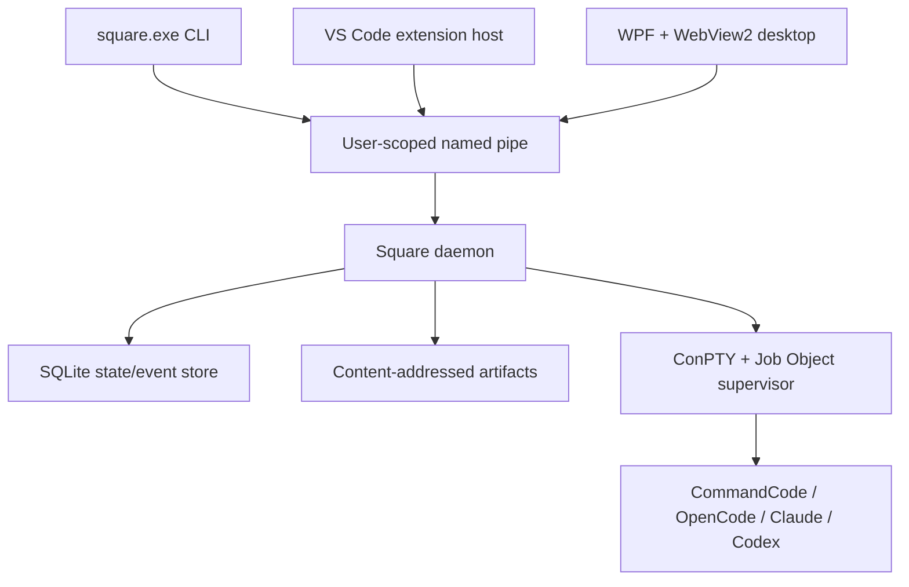
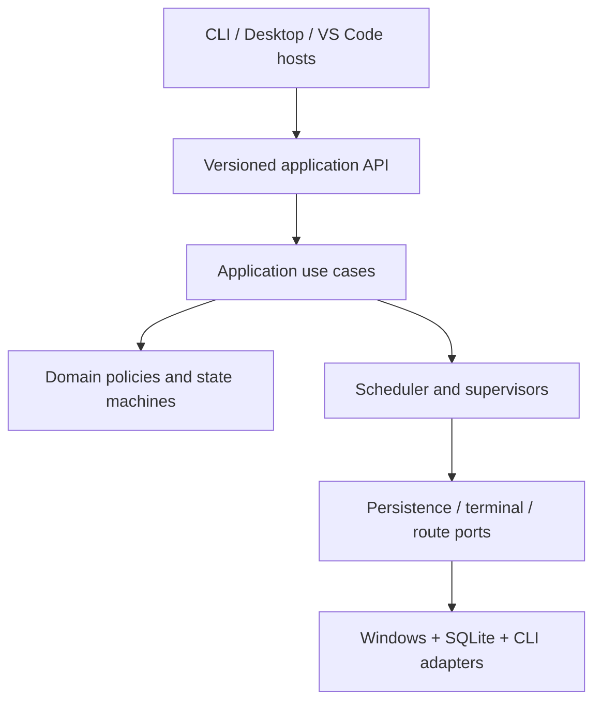
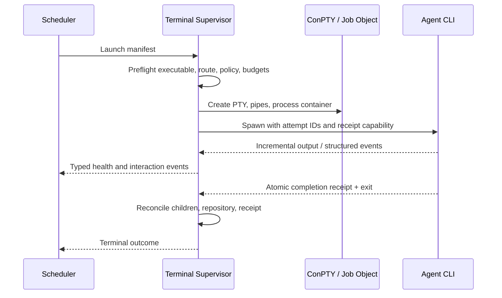

# Square Orchestrator — Windows Technical Architecture Draft

- Date: 2026-08-07
- Status: proposed architecture; no implementation authority
- Scope: Windows-installed command-line control plane, desktop dashboard, and VS Code integration
- Parent design: `2026-08-05-square-orchestrator-design.md`

## Outcome

Square Orchestrator is installed as a Windows per-user application whose primary contract is the
`square` command. Humans, VS Code, and coding agents all call the same versioned CLI/API. A durable
local daemon owns orchestration state, scheduling, terminal supervision, locks, receipts, and event
streaming. User interfaces are clients of that daemon; closing a dashboard never stops active work.

The recommended first implementation stack is:

| Area | Proposed technology | Reason |
|---|---|---|
| Runtime and domain | C# on .NET 10 LTS | Windows integration, strong async/process APIs, self-contained deployment, current LTS support |
| Per-user daemon and CLI | .NET console/worker executables sharing application libraries | One language and one domain model for lifecycle-critical code |
| Windows terminal hosting | Win32 ConPTY plus Job Objects through a narrow native interop layer | Real interactive CLI hosting and complete process-tree ownership |
| Local IPC | Versioned JSON-RPC-style messages over an ACL-restricted Windows named pipe | Easy C# and Node/VS Code clients; no local TCP port |
| Durable metadata | SQLite with controlled WAL/checkpoint policy | Transactional local state, migrations, queryable event/history views |
| Large/immutable artifacts | Content-addressed files beside the database | Avoid database bloat and duplicate terminal/evidence payloads |
| Shared UI | TypeScript component packages, xterm.js for terminal rendering | Reusable in desktop WebView2 and VS Code webviews |
| Standalone desktop shell | WPF on .NET 10 hosting WebView2 | Mature Windows shell/interop with a reusable web UI |
| VS Code integration | TypeScript extension using commands, WebviewView/editor panels, and terminal APIs | Native VS Code placement while retaining the same daemon contract |
| Packaging | Self-contained signed Windows installer plus `winget`; VSIX/Marketplace extension separately | Predictable PATH installation and independent extension updates |

.NET 10 is currently an LTS release supported through November 2028. The implementation packet must
pin an exact supported patch and revisit the runtime decision if the build begins under a newer LTS.

## Architectural principles

1. **CLI/API first.** The UI never contains orchestration logic unavailable to agents or scripts.
2. **One durable owner.** Only the daemon mutates scheduler state, terminal ownership, or repository
   locks.
3. **Per-user, not elevated.** The daemon runs in the interactive user's security context so it can
   access that user's CLI profiles and ConPTY sessions without becoming a privileged service.
4. **No localhost web server by default.** Local clients use an ACL-restricted named pipe.
5. **Event-driven clients.** UI surfaces subscribe to state deltas and bounded terminal streams; they
   do not poll entire projects or databases.
6. **Process containment.** Every agent terminal belongs to one ConPTY and Job Object/process tree.
7. **UI closure is harmless.** Terminal sessions and workflows continue when desktop/VS Code views
   close.
8. **One protocol, several surfaces.** CLI, desktop, VS Code, and future MCP adapters use the same
   commands, records, IDs, and authorization rules.
9. **Version everything.** RPC envelopes, artifacts, schemas, adapters, CLI exit codes, and event
   payloads have explicit compatibility rules.
10. **Preserve observability without transcript duplication.** Sequence-numbered bounded streams,
    immutable receipts, and content hashes replace repeated full log copies.

## Local process topology



### Executables

| Executable/component | Lifetime | Responsibility |
|---|---|---|
| `square.exe` | Short | Parse command, connect/start daemon, submit request, render human/JSON response, return stable exit code |
| `square-daemon.exe` | Per-user background | Single scheduler/state owner, IPC server, terminal/resource supervisors, persistence, event broadcast |
| `square-ui.exe` | Optional interactive | Native window and WebView2 host; no workflow ownership |
| VS Code extension | Editor session | Commands, docked views, terminal attach, status bar, daemon message bridge |
| Agent client processes | Per attempt | External CLIs hosted by daemon-owned ConPTY/process groups |
| Optional adapter host | Per adapter or daemon child | Future isolation boundary for third-party adapters; built-in adapters remain compiled/in-process initially |

### Daemon lifetime

The first CLI/UI request starts the daemon on demand if a compatible instance is not running. A
user-scoped single-instance mutex and named-pipe handshake prevent duplicates. The daemon may remain
idle for a configurable period, but it cannot exit while it owns a live terminal, writer lock,
pending receipt reconciliation, or scheduled wake-up.

A Windows Service is deliberately excluded from the initial design. Services complicate interactive
desktop/ConPTY access, user CLI credentials, and security boundaries. An enterprise service mode may
be a later separate profile.

## Logical components



### Domain kernel

Pure deterministic types and policies:

- requests, Task Briefs, Triage Decisions, plans, criteria, tasks, attempts, findings, gates;
- workflow, terminal, storage, exposure, and circuit-breaker state machines;
- trust/authority evaluation and policy precedence;
- route/specialist/skill eligibility;
- queue fairness, dependency readiness, and resource reservations;
- schema/version compatibility; and
- acceptance/integration outcome rules.

The domain kernel performs no process launch, filesystem I/O, model call, clock lookup, or UI work.
All nondeterminism enters through explicit ports so policies can be replayed in tests.

### Application layer

Command/query handlers coordinate the domain and ports:

- register/open project;
- submit/clarify/approve/cancel request;
- compile preview and execution/review packets;
- dispatch/reconcile attempt;
- answer/approve/deny terminal interaction;
- pause/resume/freeze/quarantine;
- query dashboards/history; and
- run maintenance, migrations, evaluation, and retention.

Each mutation runs under an idempotency key and produces domain events inside one transaction before
external work is launched.

### Control-plane services

- **Task Manager:** top-level request and dependency coordinator.
- **Policy Engine:** effective Trust Policy, authority, capability, and circuit-breaker checks.
- **Adaptive Router:** workflow, specialist, route, exposure, budget, and review selection.
- **Queue Scheduler:** lanes, aging, dependencies, writer/terminal/model/CPU/storage reservations.
- **Terminal Supervisor:** ConPTY, Job Object, process tree, prompts, health, receipts, attach leases.
- **Resource Supervisor:** storage I/O/temperature and future CPU/memory resource signals.
- **Usage/Exposure Meter:** tokens, cost, model-family exposure, confidence, rolling views.
- **Artifact Compiler:** Task Brief, Context Pack, Plan/Acceptance, Execution/Review/Integration packets.
- **Evaluation Service:** acceptance, findings, repair, human correction, resource/outcome metrics.
- **Recovery Reconciler:** startup discovery of processes, locks, receipts, spool, WAL/artifacts.

## Windows terminal architecture

The daemon creates one ConPTY per agent attempt. ConPTY requires the host to create the input/output
channels before spawning the character-mode child. The process is also assigned to a Job Object so
the supervisor can account for and reconcile the complete descendant tree.



### Terminal stream contract

- Output is read once by the daemon, assigned monotonically increasing sequence IDs, and retained in
  a capped memory ring plus policy-controlled chunks.
- UI subscribers request `from_sequence`; gaps return a bounded snapshot and explicit truncation
  marker rather than the entire historical transcript.
- Backpressure drops/reconstructs presentation frames, never process output required for prompt or
  receipt detection.
- Input requires a single **interactive controller lease**. Desktop and VS Code may both observe a
  terminal, but only one can type at a time.
- Agent-process input, approval, manual takeover, cancellation, and resize are separate RPC methods
  with authority checks.
- Closing a viewer releases only its subscription/controller lease; it does not close ConPTY.

### Process control

- Graceful checkpoint/interrupt is attempted before termination.
- A Job Object enables descendant discovery and cleanup, but job termination is reserved for an
  authorized hard-stop path.
- The supervisor stores enough launch/process identity to reconcile after daemon restart; exact
  reattachment limits must be proven by the Windows prototype.
- Unregistered nested coding-agent clients are gated; ordinary compilers/tests remain permitted
  children within the manifest.

## IPC and protocol

### Named pipe

Use a per-user pipe such as `\\.\pipe\square-orchestrator-<user-sid-hash>` with an explicit security
descriptor granting the current user and required system recovery identity only. Windows default
named-pipe ACLs are not sufficient because they may grant broader read access than desired.

The pipe is local-only for the initial product. Remote orchestration requires a separate authenticated
transport and threat model.

### Framing

Use a simple Content-Length or length-prefixed UTF-8 JSON message protocol inspired by JSON-RPC:

```json
{
  "protocol": "square.rpc",
  "version": "1.0",
  "id": "01J...",
  "method": "request.submit",
  "idempotency_key": "01J...",
  "params": {},
  "client": { "kind": "cli", "version": "0.1.0" }
}
```

Responses contain either a typed result or typed error. Event subscriptions use the same envelope
with a subscription ID and monotonic event sequence. Required semantics are schema-versioned; clients
reject incompatible versions during handshake.

### Why not direct database access

Only the daemon opens the authoritative database for mutation. CLI/UI clients never query SQLite
directly because that would bypass policy, couple them to schema internals, and complicate migrations
and WAL ownership.

## CLI contract

The CLI is designed for humans and agents:

```text
square <group> <command> [options]
square ... --json --non-interactive --correlation-id <id>
```

Rules:

- human output is concise and stable in meaning, but not parsed by automation;
- `--json` emits one versioned result/event shape to stdout;
- diagnostics go to stderr;
- no color/control codes under `--json` or when output is redirected;
- non-interactive mode never waits on a prompt: it returns a typed gate/interaction ID;
- mutating commands accept idempotency keys;
- command exit codes are documented and versioned; and
- agents use IDs and JSON fields, never screen coordinates or UI text.

### Initial command surface

| Group | Representative commands |
|---|---|
| Daemon | `daemon start`, `status`, `doctor`, `stop` |
| Project | `project add`, `list`, `show`, `open`, `policy show` |
| Request | `request submit`, `show`, `approve`, `amend`, `pause`, `resume`, `cancel` |
| Task | `task list`, `show`, `graph`, `retry`, `accept` |
| Terminal | `terminal list`, `show`, `attach`, `answer`, `approve-once`, `deny`, `checkpoint`, `cancel` |
| Attempt | `attempt show`, `complete`, `stop`, `receipt validate` |
| Route | `route list`, `probe`, `certify`, `quarantine`, `exposure` |
| Skill | `skill list`, `canary`, `qualify`, `revoke` |
| Resource | `resource status`, `storage`, `cooldown`, `limits` |
| Events | `events watch`, `events since` |
| UI | `ui`, `vscode install` |

The exact names are draft. The protocol operations and records are authoritative; aliases may evolve.

## Persistence architecture

### Paths

Proposed per-user layout:

```text
%LOCALAPPDATA%\SquareOrchestrator\
  state\square.db
  state\square.db-wal
  state\square.db-shm
  artifacts\sha256\ab\<hash>
  terminal\<session-id>\chunks\
  spool\
  cache\indexes\
  logs\

%APPDATA%\SquareOrchestrator\
  config.toml
  policies\
  ui-layouts\
```

Repositories retain their own accepted authority documents. Local application state references
repository paths and hashes; it does not silently place canonical project decisions in AppData.

### SQLite policy

- One daemon owns writes; UI/CLI access state through RPC.
- Short batched transactions persist events and state transitions.
- WAL mode is a candidate, not a license for frequent writes: checkpoint cadence, synchronous mode,
  backups, and recovery are selected through measured crash/I/O tests.
- The database and its WAL/SHM files are treated as one state set during backup/recovery.
- Large terminal chunks, diffs, screenshots, context packs, and reports live in the content-addressed
  artifact store with hashes/metadata in SQLite.
- Retention never deletes an artifact still referenced by an immutable attempt or acceptance record.

## Desktop and VS Code surfaces

### Shared UI package

One TypeScript design system supplies layout model, state badges, task/agent components, event
timeline, inspectors, and terminal bindings. Host adapters isolate:

- daemon RPC/subscriptions;
- filesystem/open-file actions;
- clipboard and notifications;
- terminal controller lease/input;
- theme tokens and keyboard command registration; and
- VS Code versus WebView2 message bridges.

The UI never connects directly to agent CLIs or repository locks.

### Standalone desktop

`square ui` launches a WPF window with one WebView2 surface. WPF owns window lifetime, native menus,
file dialogs, notifications, and WebView2 message validation. The web UI renders the dock workspace
and xterm.js terminals.

Use the Evergreen WebView2 Runtime with installer detection/bootstrap and an offline deployment option.

### VS Code extension

The extension contributes:

- Activity Bar container and Tree Views for requests/tasks/agents;
- a docked WebviewView for the fleet/queue and an editor-area dashboard panel;
- commands matching the CLI operations;
- status-bar summary for daemon, active agents, gates, writer lock, and resource state;
- optional Task Provider and terminal profile/attach commands; and
- file/diff navigation from artifacts and findings.

The Node extension host owns the named-pipe client. Webviews communicate only with the extension host
through validated messages and a strict Content Security Policy; they never receive pipe handles or
arbitrary filesystem access.

## Security boundaries

- Named pipe ACL restricted to the current user; RPC performs version and client-instance handshake.
- UI messages use allow-listed command schemas and reject arbitrary shell strings.
- WebView2 navigation, new windows, downloads, host-object exposure, and external origins are disabled
  unless a specific UI requirement authorizes them.
- VS Code webviews use nonce-based scripts, local-resource roots, and strict CSP.
- Agent terminal output is untrusted text. It is rendered by the terminal emulator and cannot invoke
  host RPC methods through escape sequences.
- Credentials stay with installed CLIs/Windows credential facilities and never enter state artifacts.
- Adapter/skill code is built-in or qualified/signed; third-party extension points are isolated later.
- Trust Policy is checked again at dispatch and interaction approval, not only at request intake.

## Packaging and update model

Initial packaging should provide:

- self-contained x64 and arm64 Windows builds;
- signed per-user installer with optional machine-wide administrator installation;
- PATH registration for `square.exe`;
- WebView2 Evergreen dependency detection and offline installer option;
- `winget` manifest after signed release artifacts are stable;
- separate signed VSIX/Marketplace extension whose protocol compatibility is declared; and
- side-by-side-safe update: stop accepting new dispatch, checkpoint/reconcile, migrate under backup,
  start new daemon, and roll back app binaries if migration/application startup fails.

Uninstall offers to retain or remove state. It never deletes repositories, worktrees, or uncommitted
patches automatically.

## Proposed solution/module layout

```text
src/
  Square.Domain/                 pure records, policies, state machines
  Square.Application/            commands, queries, orchestration use cases
  Square.Contracts/              RPC, artifact, schema and exit-code contracts
  Square.ControlPlane/           scheduler, router, supervisors, circuit breakers
  Square.Persistence.Sqlite/     migrations, event/state repositories
  Square.Artifacts/              content-addressed storage and retention
  Square.Platform.Windows/       ConPTY, Job Objects, named pipes, storage telemetry
  Square.Adapters.Abstractions/  route/CLI adapter contracts
  Square.Adapters.CommandCode/
  Square.Adapters.OpenCode/
  Square.Adapters.Claude/
  Square.Adapters.Codex/
  Square.Daemon/
  Square.Cli/
  Square.Desktop/
ui/
  packages/design-system/
  packages/workspace/
  packages/terminal/
  packages/host-contract/
vscode/
  square-vscode/
tests/
  Domain.Tests/
  Contract.Tests/
  Recovery.Tests/
  WindowsTerminal.Tests/
  AdapterConformance/
  EndToEnd/
```

Dependencies point inward toward Domain/Contracts. Platform, persistence, adapters, and hosts are
leaf implementations.

## Verification strategy

### Deterministic tests

- state-machine transition and property tests;
- queue fairness/aging and resource-reservation tests;
- Trust Policy and authority precedence tests;
- artifact/schema compatibility and migration golden tests;
- model exposure/cost calculations;
- circuit-breaker and acceptance/integration rules.

### Windows integration tests

- ConPTY startup, resize, UTF-8/ANSI, stdin, output, and close behavior;
- Job Object child containment and graceful/hard cancellation;
- named-pipe ACL and reconnect behavior;
- daemon crash/restart with live/stale processes, locks, spool, WAL, and artifacts;
- WebView2/VS Code bridge schema rejection and terminal controller lease.

### Adapter certification fixtures

- known prompt, permission, auth, rate limit, invalid model/flag, crash, timeout, receipt, and silent
  fallback cases for each exact CLI version.

### UI tests

- component/state fixtures;
- keyboard and screen-reader accessibility;
- dock restore/migration;
- high-volume terminal event backpressure;
- Playwright against shared web UI plus extension-host integration tests.

## Architecture decisions to prove before commitment

1. .NET 10/WPF/WebView2 prototype can host and stream several ConPTY sessions with acceptable CPU,
   memory, latency, and SSD writes.
2. Named-pipe JSON framing supports CLI, WPF, and Node extension clients with reconnect/backpressure.
3. A current-user daemon can reliably contain/reconcile all target CLIs through Job Objects.
4. xterm.js correctly renders target CLI output and preserves safe interactive-controller leasing.
5. Shared TypeScript UI can run under both WebView2 and VS Code CSP/resource constraints.
6. SQLite transaction/WAL/checkpoint settings meet crash recovery and SSD protection requirements.
7. Installer/update flow preserves live-work safety and protocol compatibility.

If a proof fails, replace only the leaf technology. The domain, application, protocol, and artifact
contracts remain unchanged.

## Technical references

- Microsoft: [creating a Windows pseudoconsole session](https://learn.microsoft.com/en-us/windows/console/creating-a-pseudoconsole-session)
- Microsoft: [named pipes](https://learn.microsoft.com/en-us/windows/win32/ipc/named-pipes) and
  [named-pipe security/access rights](https://learn.microsoft.com/en-us/windows/win32/ipc/named-pipe-security-and-access-rights)
- VS Code: [Extension API including Pseudoterminal](https://code.visualstudio.com/api/references/vscode-api)
- Microsoft: [WebView2 overview](https://learn.microsoft.com/en-us/microsoft-edge/webview2/) and
  [distribution](https://learn.microsoft.com/en-us/microsoft-edge/webview2/concepts/distribution)
- Microsoft: [.NET releases and support](https://learn.microsoft.com/en-us/dotnet/core/releases-and-support)
- xterm.js: [project documentation](https://github.com/xtermjs/xterm.js/blob/master/README.md)
- SQLite: [write-ahead logging](https://www.sqlite.org/wal.html)
