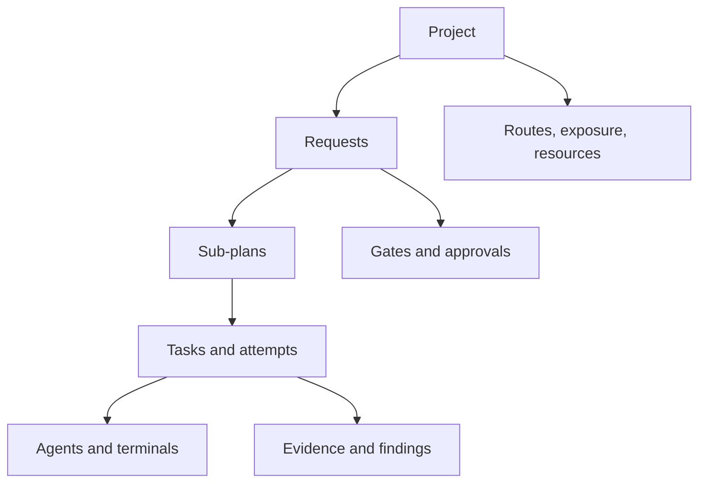

# Square Orchestrator — Terminal Workspace UI Design Draft

- Date: 2026-08-07
- Status: proposed UI; no implementation authority
- Hosts: standalone Windows desktop and VS Code extension
- Parent design: `2026-08-05-square-orchestrator-design.md`
- Technical architecture: `square-orchestrator-technical-architecture.md`

## Experience outcome

The interface feels like a modern operations terminal: dense, fast, keyboard-friendly, and explicit
about processes, authority, and state. It is not a wall of raw consoles. Terminals occupy the center,
while structured docked panes show requests, task contracts, approvals, review findings, resource
health, model exposure, and evidence.

The same workspace model appears in the standalone Windows app and VS Code. Layout may differ by
available width, but commands, IDs, terminology, state colors, and interaction rules remain the same.

## Design principles

1. **Work is visible, not noisy.** Healthy agents show concise live state; raw terminal output is one
   selectable layer.
2. **Urgent states interrupt visually, not conversationally.** Approval, authentication, blockers,
   storage gates, and terminal failure appear in a dedicated action queue.
3. **Every action shows its authority.** Approve once, amend scope, grant network access, cancel, and
   force-stop are visually distinct.
4. **One selected context.** Selecting a request, task, agent, terminal, finding, or event updates the
   Inspector rather than opening redundant detail panels.
5. **Docking supports observation.** Users can see several agents at once without making every pane
   permanently visible.
6. **Terminal styling serves hierarchy.** Monospace IDs, restrained separators, compact status lines,
   and dark/light terminal themes—not decorative scanlines or fake hacker effects.
7. **Color never carries state alone.** Every state has text, icon, and shape/treatment.
8. **The UI is never authority.** It sends versioned commands to the daemon; it does not mutate state
   optimistically before acknowledgement.
9. **Closing a view is safe.** It releases a subscription/controller lease, not the agent process.
10. **Keyboard and mouse are peers.** Every dock, terminal, approval, and navigation operation has an
    accessible command path.

## Product surfaces

| Surface | Primary use | Scope |
|---|---|---|
| `square` CLI | Agents, automation, fast human commands | Complete command/API coverage, human or JSON output |
| Standalone desktop | Multi-project operations room | Full dock canvas, several terminals, resource/exposure dashboards |
| VS Code Activity Bar | Quick project status and navigation | Requests/tasks/agents tree, approvals, badges |
| VS Code editor panel | Project workspace | Docked dashboard/terminals/diff/review within the editor area |
| VS Code integrated terminal | Direct `square` commands and attach | Native terminal interaction using the same daemon session |
| Notifications/status bar | Time-sensitive state | Blockers, approvals, daemon/resource/writer status |

## Information architecture

The hierarchy is navigational, not ownership: terminals belong to attempts, findings belong to an
immutable result, and approvals belong to Interaction Requests or gates.

## Main workspace shell

The standalone window uses five stable zones:

| Zone | Location | Content |
|---|---|---|
| Command bar | Top | Project selector, global command field, layout preset, live-work summary, pause control |
| Navigator | Left | Requests, tasks, agents, queue, approvals, artifacts, evaluations, settings |
| Dock canvas | Center | Terminal, graph, plan, diff, review, event, resource, and dashboard panes |
| Inspector | Right | Selected item contract, route/model, health, budgets, authority, actions |
| Status strip | Bottom | Daemon, repository/writer lock, queue, model exposure, cost, SSD/resource state |

The Navigator and Inspector collapse independently. The Dock Canvas always receives the remaining
space. On narrow VS Code sidebars, the Navigator becomes the surface and opens detailed items in an
editor panel rather than squeezing all five zones.

## Dock system

### Dock behavior

- Panes may be tabbed, split horizontally/vertically, reordered, maximized, or closed.
- Closing a terminal pane does not stop the process.
- Drag/drop targets are clear and keyboard commands provide equivalent move/split actions.
- Minimum pane sizes prevent unreadable terminals or clipped approval controls.
- Layout state is saved per project and host with a versioned schema.
- Missing/renamed pane types restore as a visible compatibility placeholder rather than disappearing.
- Detached native windows are postponed until the shared dock and controller-lease behavior are
  proven.

### Preset layouts

| Preset | Center canvas |
|---|---|
| Operations | Agent Fleet plus selected terminal; approvals/events below; Inspector open |
| Focus | One maximized terminal/task pane; compact Navigator and Inspector |
| Plan | Request/task graph beside Plan/Acceptance Contract; context/evidence below |
| Review | Diff and findings beside Review terminal; acceptance criteria below |
| Resources | Agent Fleet beside route exposure/cost; storage/process events below |

Presets rearrange existing pane instances; they do not discard user tabs or terminal subscriptions.

## Pane catalogue

### Agent Fleet

A compact grid/list of active or attention-required attempts. Each row/tile shows:

- role/specialist and stable attempt/task ID;
- CLI plus exact model family;
- terminal state and elapsed time;
- current stage and last meaningful activity;
- normalized session tokens and model exposure state;
- writer/read-only badge and repository/worktree;
- one concise blocker/approval/resource indicator; and
- open/focus action.

Healthy agents are visually quiet. `WAITING_FOR_APPROVAL`, `AUTH_REQUIRED`, `BLOCKED`,
`SUSPECTED_STALL`, `FAILED_*`, and storage/circuit-breaker states rise to the top under an explicit
attention grouping; the list does not reorder active rows on every output event.

### Agent Terminal

Header:

- role and task title;
- model/CLI route;
- `RUNNING`, `QUIET_ACTIVE`, `WAITING_*`, `BLOCKED`, or terminal outcome;
- elapsed time, token exposure, equivalent USD, and writer/read-only state;
- controller lease indicator: `VIEW`, `CONTROL`, or `CONTROLLED ELSEWHERE`;
- actions: focus, attach/control, checkpoint, cancel, more.

Body:

- xterm.js stream with sequence/truncation markers;
- search/copy available through terminal affordances;
- no UI hyperlinks or escape-sequence actions execute host commands automatically;
- scrollback cap and retained-output indicator; and
- optional structured event markers between output regions without altering raw output.

Interaction bar appears only when necessary:

| State | Bar content |
|---|---|
| `WAITING_FOR_INPUT` | Redacted question, answer field, designated responder, expiry, answer/cancel |
| `WAITING_FOR_APPROVAL` | Exact command/capability/path/network request, policy comparison, approve once/deny/amend |
| `AUTH_REQUIRED` | Manual takeover instructions and attach button; never a credential field |
| `BLOCKED` | Blocker class/evidence and route to owner/Orchestrator amendment |
| `SUSPECTED_STALL` | Health signals, deterministic recheck, wait/checkpoint/cancel options |
| `UNRESPONSIVE` | Graceful interrupt status and clearly separated force-stop authority |

### Request and task graph

- Sub-plans and tasks are nodes; dependencies are directed edges.
- Node label always includes stable ID (`SP01-T02`) and concise title.
- State is shown through icon/text plus restrained color.
- Selecting a node updates the Inspector and filters related terminals/findings/events.
- Critical path, blocked dependency, current writer, and integration boundary are optional overlays,
  not simultaneous default clutter.

### Plan and Acceptance Contract

- Hierarchical sub-plan/task navigation.
- Decision register and version/hash header.
- `AC-xx` criteria table with verifier, evidence, status, commit, and owner/manual gate.
- Amendment comparison shows exactly which decisions/criteria changed.
- Grunt discretion and `STOP` boundaries are visually separated from implementation guidance.

### Diff and Review

- Starting/result commit and authority/plan hashes.
- File tree, diff, deterministic validation, findings, and criterion links.
- Severity filters are allowed; default shows all open findings.
- A finding can create/propose a fix task but cannot edit code from the review pane.
- Combined Integration Packet mode highlights cross-task ownership and interface changes.

### Approvals and gates

Dedicated queue ordered by urgency/expiry, not creation spam. Each item shows:

- interaction/gate type and exact requested action;
- project/request/task/terminal;
- requester and route;
- authority required;
- redacted evidence and risk;
- approve once, deny, amend, attach, postpone, or cancel as applicable; and
- safe default when it expires.

Destructive, network, trust-policy, and force-stop actions use a confirmation step that repeats the
exact scope. Routine pre-authorized actions do not appear merely to inflate activity.

### Events and Problems

One time-ordered operational stream with typed filters:

- workflow transitions;
- terminal health/interactions;
- gates/circuit breakers;
- validations/findings;
- route/adapter/skill changes;
- storage/resource events; and
- owner actions.

The default excludes raw terminal lines. Selecting an event reveals its artifact/evidence and
causation chain.

### Route exposure and cost

Show model-family concentration independently from money:

- normalized exposure tokens and share by model family;
- rolling and project-lifetime windows;
- `BALANCED`, `DOMINANT`, `OVEREXPOSED`, or `ROTATION_REQUIRED`;
- consecutive assignments and eligible underused alternatives;
- actual, equivalent, and allocated subscription USD in a separate view; and
- confidence/source for every estimated number.

The UI must not imply that the most expensive or least-used model is automatically best.

### Resource health

- per-volume current state, temperature/telemetry freshness, I/O class/queue, rolling reads/writes;
- `TELEMETRY_DEGRADED`, throttle, cooldown, health gate;
- active process/resource reservations;
- next heavy job and reason it is waiting; and
- owner thresholds/policy link.

No fake zero values when telemetry is unavailable.

## Inspector design

The Inspector is contextual and single-instance. Sections appear only when relevant:

1. Identity and immutable baseline
2. Current state and causal blocker
3. Task/Acceptance Contract
4. Route/model/specialist/skill certification
5. Token/exposure/cost and resource budgets
6. Trust/authority and requested capability
7. Evidence/findings
8. Available authorized actions

Actions are rendered from server-provided capabilities, not inferred from role names in the UI.
After a command is sent, the control is pending until the daemon acknowledges a new state/event.

## Primary user flows

### Quick edit

1. User submits through CLI, command field, or VS Code command.
2. Compact Dispatch Preview shows `QUICK`, one specialist/route, paths, targeted validation, and cost/
   resource estimate.
3. Policy auto-runs or user approves.
4. One terminal appears; Fleet and status strip update.
5. Targeted evidence and receipt complete; result opens in Diff/Acceptance pane.

The flow does not force the user through a plan graph or empty specialist panels.

### Planned/systemic request

1. Intake preview exposes specialists, Scouts, routes, phases, budgets, trust/network and gates.
2. Context terminals appear as a tab group; Orchestrator opens when `CONTEXT_READY`.
3. Plan/Acceptance Contract waits for owner acceptance when required.
4. Implementation terminals appear by task dependency.
5. Review and Integration workspaces use their dedicated preset.
6. Final acceptance binds the combined commit and evidence.

### Terminal asks a question or permission

1. Terminal header and Approvals badge change immediately.
2. Interaction bar shows exact request and policy context.
3. User answers/approves once/denies/amends or attaches manually.
4. Daemon acknowledges and terminal returns to running or closes safely.

No background model answers because the UI happens to be closed; unresolved interactions remain
durable and notify through the allowed host.

### Suspected stall

1. Pane moves from `QUIET_ACTIVE` to `SUSPECTED_STALL` only after multi-signal policy.
2. Inspector shows last output, heartbeat, CPU/I/O/child signals, and crossed deadline.
3. Deterministic recheck runs; bounded Terminal Triage appears only if invoked.
4. User may wait, checkpoint, attach, cancel, or authorize hard stop depending on state.

## Command and keyboard model

- One global command field/palette exposes all server-authorized actions.
- Commands use verbs matching the CLI: submit, approve once, deny, attach, checkpoint, pause, resume,
  cancel, quarantine, focus, open artifact.
- Pane navigation, focus, close, split, and move are keyboard accessible.
- Terminal keystrokes go to the PTY only while the terminal owns the controller lease and has focus.
- A visible mode indicator prevents command shortcuts from being mistaken for terminal input.
- Host conflicts are resolved through VS Code's keybinding system; the extension does not hard-code
  global shortcuts over user mappings.

## Visual system

### Typography

- UI/navigation: Windows system UI font for compact readability.
- IDs, metrics, commands, code, and terminals: Cascadia Mono with a system monospace fallback.
- Terminal aesthetic comes from alignment, density, separators, and monospace data—not using
  monospace for long descriptive prose.

### Color tokens

Use theme tokens rather than fixed colors:

- canvas, panel, panel-raised, divider;
- text-primary, text-secondary, text-disabled;
- focus/accent;
- state-info, state-success, state-warning, state-danger;
- role/read-only/writer markers where they remain distinguishable; and
- terminal ANSI palette controlled separately.

Light, dark, and high-contrast modes are first-class. State labels/icons remain readable without
color.

### Density and chrome

- Compact 28–32px command/tab/header rows in the eventual native implementation, subject to
  accessibility testing.
- Borders and one-level surfaces define docks; avoid layered card stacks and excessive rounding.
- Metrics use tabular numerals.
- Animation is limited to dock movement, acknowledged state transitions, and progress; no continuous
  decorative glow or scrolling.

## Accessibility

- Complete keyboard path for navigation, dock management, terminal control, and approvals.
- Screen-reader names include task, role, model, state, and attention reason.
- Live regions announce only important transitions; terminal output is not continuously announced by
  default.
- xterm.js screen-reader/contrast options are exposed.
- Focus is moved deliberately when a pane closes or a critical interaction opens.
- Color contrast, zoom, Windows text scaling, and high-contrast themes are tested.
- Destructive/approval controls never depend on icon/color alone.
- Reduced-motion preference disables nonessential transitions.

## Data and performance behavior

- UI subscribes to project/terminal topics and applies sequence-numbered deltas.
- High-frequency output is batched per animation frame and virtualized/capped.
- Hidden panes reduce rendering frequency but do not unsubscribe from critical state.
- Reconnect requests events since the last sequence; truncation is explicit.
- Large graphs, event lists, diffs, and tables are virtualized in implementation.
- Layout persistence is debounced and written only after stable changes to reduce SSD churn.
- Terminal scrollback belongs to daemon retention policy, not unbounded browser memory.

## Host differences

| Behavior | Standalone Windows | VS Code |
|---|---|---|
| Main workspace | Full five-zone window | Activity Bar + editor panel; optional lower panel |
| File/diff opening | Native request forwarded to configured editor | Direct `vscode.open`/diff commands through extension host |
| Notifications | Windows/app notification | VS Code notification and badges |
| Terminal attach | Embedded xterm.js | Shared webview terminal or VS Code Pseudoterminal/integrated terminal attach |
| Layout persistence | Per project/window | Per workspace/profile |
| Command palette | App palette | VS Code Command Palette and view actions |

## UI delivery by technical slice

### Slice 0

- Fake terminal dock, process states, approvals queue, event log, pause/cancel, restart/layout restore.

### Slice 1

- Project/request navigation, Dispatch Preview, one real terminal, Task/Acceptance/Diff panes, basic
  status strip.

### Slice 2

- Agent Fleet, plan/task graph, specialists/skills, integration review, fair queue views.

### Slice 3

- Route/model views, exposure/cost dashboard, cross-model review attribution, adapter certification.

### Slice 4

- Resource/SSD view, evaluation dashboards, circuit-breaker/quarantine controls, large-data
  virtualization.

### Slice 5

- Multi-worktree/merge queue, advanced layouts, cross-project operations, optional detached windows.

## UI acceptance criteria

1. User can identify every active agent, role, model, task, terminal state, and writer lock without
   opening raw logs.
2. Approval/auth/blocker/failure states are visible within one event update and persist across UI/
   daemon restart.
3. Closing/reopening/moving a terminal pane never stops or duplicates its process.
4. Two viewers cannot type into one terminal without an explicit controller-lease transfer.
5. A simple `QUICK` request completes without exposing irrelevant full-workflow panes.
6. Planned work can display at least four simultaneous terminals in a usable dock layout.
7. Every displayed number identifies measured versus estimated confidence where applicable.
8. Model exposure is visually separate from cost and session-context pressure.
9. Storage telemetry unavailable is never displayed as zero/healthy.
10. Keyboard-only and screen-reader users can submit, inspect, approve/deny, attach, checkpoint, and
    cancel safely.
11. Standalone and VS Code hosts show the same authoritative state and command outcome.
12. High terminal-output volume remains responsive through bounded buffering/backpressure.

## Parked UI decisions

- exact docking library after license, accessibility, performance, and restore-schema evaluation;
- whether the VS Code terminal view uses the shared xterm.js pane, a Pseudoterminal, or both;
- detachable native panes;
- exact font/spacing tokens after Windows scaling tests;
- graph rendering library;
- diff component versus delegating all diff display to VS Code;
- Windows notification behavior and quiet hours;
- multi-monitor window restore; and
- user-customizable themes beyond system light/dark/high-contrast.
