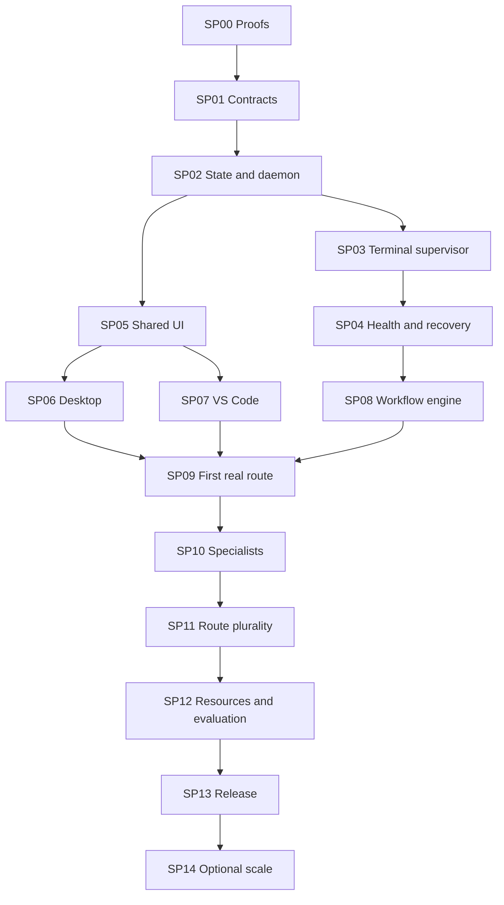

# Square Orchestrator — Sliced Implementation Plan

- Date: 2026-08-07
- Status: implementation-ready draft; owner acceptance required before dispatch
- Parent design: `2026-08-05-square-orchestrator-design.md`
- Architecture companion: `square-orchestrator-technical-architecture.md`
- UI companion: `square-orchestrator-ui-design.md`
- Target: Windows-first per-user application, callable from terminals, VS Code, humans, and agents

## 1. Delivery outcome

Build Square Orchestrator as a CLI-first local control plane that can launch and supervise agent CLIs,
coordinate low-cost workers and high-end orchestrators without live model-to-model monitoring, and
show the authoritative state in a terminal-style docked desktop/VS Code interface.

The first usable release must prove all of the following:

1. `square.exe` can submit and inspect work through a durable per-user daemon.
2. The daemon can run one real agent CLI through ConPTY, detect known terminal conditions without an
   LLM, contain the process tree, and recover its state after application restart.
3. A `QUICK` task avoids the full orchestration workflow while a `PLANNED` task produces a bounded
   context handoff, accepted plan, implementation attempt, deterministic verification, review, and
   repair loop.
4. Desktop and VS Code clients display the same tasks, terminals, approvals, events, and locks without
   owning any workflow state.
5. Later slices add specialist teams, all four requested CLI families, exposure balancing, equivalent
   USD indicators, and storage-aware scheduling without replacing the kernel.

## 2. Canonical task format

- `SP00` identifies a cohesive sub-plan.
- `SP00-T01` identifies one independently dispatchable task.
- `SP00-T01-ST01` is permitted only for sequential checkpoints that cannot be dispatched separately.
- IDs never change or get reused. A changed contract produces a plan amendment, not a renamed ID.
- One task should normally fit one fresh worker session and one reviewable commit.
- A task may touch several files when they form one atomic contract, but it must not combine unrelated
  infrastructure, UI, and product-policy decisions.

Every dispatch packet generated from this plan must include:

- task ID and title;
- exact starting commit and authority-document hashes;
- prerequisites and dependency outputs;
- allowed read paths and allowed write paths;
- relevant global invariants and acceptance IDs;
- expected files, symbols, behavior, errors, and edge cases;
- validation commands and evidence schema;
- time, retry, context, and output budgets;
- discretion envelope and explicit `STOP` conditions; and
- completion-receipt destination.

## 3. Locked implementation decisions

These decisions are part of the current plan and cannot be changed by an implementation worker:

| Area | Locked decision |
|---|---|
| Runtime | C# on a pinned .NET 10 LTS patch |
| Domain ownership | One per-user daemon is the only scheduler and state mutation owner |
| CLI | `square.exe` is the stable human/agent entry point |
| IPC | Versioned, length-framed JSON RPC/events over an ACL-restricted Windows named pipe |
| Terminal hosting | One ConPTY plus Job Object/process tree per attempt |
| Persistence | SQLite metadata/event state plus content-addressed artifact files |
| Desktop | WPF shell hosting a shared TypeScript UI through WebView2 |
| VS Code | TypeScript extension; extension host owns pipe access; webviews never do |
| Terminal UI | xterm.js through an internal terminal-view abstraction |
| Workflow ownership | Model sessions are disposable workers; no model remains open to monitor another |
| Health monitoring | Deterministic process/PTY/prompt signals first; bounded low-cost triage only for unknown states |
| Routing metric | Model exposure is distinct from actual/equivalent USD cost and context pressure |
| Storage | Buffered/batched writes and storage-aware concurrency; unavailable telemetry is `DEGRADED`, not healthy |
| Security | Per-user non-elevated default; credentials remain with installed CLIs |

Technology may be replaced only after a recorded proof task demonstrates that a leaf choice cannot
satisfy its contract. Domain records, application behavior, and protocol semantics must remain
technology-neutral.

## 4. Global invariants

The following apply to every sub-plan:

1. Closing a UI must never stop an active workflow or terminal.
2. UI, CLI, and extensions never mutate SQLite directly.
3. Every mutation is idempotent and produces a durable event before external work begins.
4. Exactly one writer lease may exist for a repository/worktree at a time until the advanced
   multi-worktree slice is explicitly enabled.
5. A lack of terminal output alone is not a stall and never authorizes termination.
6. Terminal prompts, approvals, authentication requests, blockers, and completion are typed durable
   events, not inferred only from UI text.
7. A model is never used for continuous terminal monitoring.
8. A worker cannot decide requirements, architecture, public contracts, schema, security policy, or
   cross-task behavior outside its discretion envelope.
9. `QUICK` tasks retain safety, receipt, lock, evidence, and cancellation contracts even when planning
   and specialist stages are skipped.
10. Session context thresholds are warning at 100K, planned handover at 120K, and hard stop at 150K
    or the route's lower limit.
11. Token/cost telemetry never overrides capability, trust, security, or task-fit eligibility.
12. Storage protection may delay work without keeping a model session open.
13. All public records and RPC messages carry a schema/protocol version.
14. All destructive or authority-expanding actions require an explicit policy path and audit event.

## 5. Release gates

| Gate | Included sub-plans | Result |
|---|---|---|
| G0 — Architecture proof | SP00 | Risky Windows/UI primitives proven or rejected with evidence |
| G1 — Deterministic kernel | SP01–SP04 | Fake-adapter workflows survive prompts, failures, and restart without model monitoring |
| G2 — Operable shell | SP05–SP07 | CLI, desktop, and VS Code expose one authoritative docked workspace |
| G3 — First useful release | SP08–SP09 | `QUICK` and `PLANNED` work through one certified real CLI |
| G4 — Adaptive team | SP10 | Specialists, skills, review independence, and bounded fix loops work |
| G5 — Plural routes | SP11 | Four CLI families and model-exposure balancing are supported where certifiable |
| G6 — Sustained operation | SP12 | Index reuse, I/O budgets, thermal fallback, and outcome metrics are enforced |
| G7 — Windows release | SP13 | Signed installer/update/uninstall and recovery meet release criteria |
| G8 — Optional scale | SP14 | Parallel worktrees/practice evolution enabled only after measured justification |

## 6. Dependency overview

SP05 may start against recorded fixtures once SP01 contracts are stable. SP06 and SP07 may proceed in
parallel after the shared host contract is frozen. No real provider CLI is used as the lifecycle test
oracle before SP03–SP04 pass against deterministic fixtures.

---

# SP00 — Architecture proof and repository foundation

## Outcome

Burn down the highest-risk Windows and shared-UI assumptions before building product logic. Produce a
solution that builds reproducibly on Windows x64, with CI checks that do not require provider accounts.

## Cross-task decisions

- Spikes live under `prototypes/` and are not referenced by production projects.
- A proof result records environment, versions, measurement method, raw evidence, conclusion, and
  resulting architecture decision.
- Failed proofs can replace a leaf technology only through a plan amendment.

## SP00-T01 — Bootstrap solution, tooling, and dependency rules

**Objective:** Create the production repository skeleton and reproducible developer commands.

**Implementation:**

- Create `SquareOrchestrator.slnx` and production/test projects matching the architecture module tree.
- Add `Directory.Build.props`, `Directory.Packages.props`, `.editorconfig`, nullable/reference analysis,
  warnings-as-errors for first-party code, deterministic builds, and pinned SDK through `global.json`.
- Add `ui/` pnpm workspace and `vscode/square-vscode/` package with pinned Node and package-manager
  declarations.
- Add scripts: `build.ps1`, `test.ps1`, `format.ps1`, `dev.ps1`, and `package.ps1`; scripts must use
  documented parameters and return nonzero on failure.
- Add architecture dependency tests preventing Domain/Application/Contracts from referencing host,
  platform, adapter, or UI projects.
- Add test categories so Windows-only, provider conformance, UI, and deterministic tests can run
  independently.

**Expected code areas:** repository root, `build/`, empty `src/`, `tests/`, `ui/`, and `vscode/` shells.

**Dependencies:** none.

**Validation:** clean Windows checkout runs restore, build, deterministic unit tests, and UI lint/test
without installed agent CLIs.

**Evidence:** SDK/package lockfiles, dependency-test output, build/test logs.

**Worker discretion:** internal script naming and analyzer selection within the stated contract.

**STOP if:** a dependency requires a system-wide service, administrator rights for development, or an
unreviewed copyleft/runtime license.

## SP00-T02 — Prove ConPTY and Job Object lifecycle

**Objective:** Demonstrate reliable interactive process hosting and descendant containment.

**Implementation:**

- Build `prototypes/TerminalProof` using a narrow Win32 interop layer for pseudoconsole creation,
  resize, input/output pipes, process startup, Ctrl+C/graceful cancellation, and teardown.
- Assign the spawned process to a Job Object and prove descendant discovery/cleanup with a fixture
  that creates nested child processes.
- Capture Unicode, ANSI, large burst output, a quiet-but-running child, stdin questions, resize, normal
  exit, crash, and forced termination.
- Measure CPU, working set, output latency, and write volume for one, four, and eight sessions.
- Record which parts can and cannot be reattached after daemon failure; do not assume PTY reattachment.

**Expected code areas:** `prototypes/TerminalProof/`, `docs/proofs/conpty-job-object.md`.

**Dependencies:** SP00-T01.

**Validation:** automated harness executes every scenario 100 times without leaked process trees or
handle-count growth beyond a documented tolerance.

**STOP if:** target CLIs cannot run correctly through ConPTY or a current-user process cannot contain
their descendants. Escalate with raw evidence and proposed leaf alternatives.

## SP00-T03 — Prove named-pipe framing and reconnect

**Objective:** Validate one local protocol transport for .NET, Node, and the desktop host.

**Implementation:**

- Prototype length-prefixed UTF-8 JSON envelopes with handshake, request/response, cancellation,
  subscription, monotonic event sequence, bounded queue, reconnect, and incompatible-version errors.
- Create a .NET server/client and Node client fixture.
- Apply an explicit security descriptor restricted to the current user SID and required system
  identity; add a negative access test from another identity where CI permits.
- Test fragmented frames, oversized messages, malformed JSON, slow subscribers, daemon restart, and
  replay from an event sequence.

**Expected code areas:** `prototypes/PipeProof/`, `docs/proofs/named-pipe-protocol.md`.

**Dependencies:** SP00-T01.

**Validation:** contract fixtures produce identical results from .NET and Node clients; slow clients
cannot exhaust unbounded server memory.

**STOP if:** Node named-pipe behavior cannot preserve framing/reconnect semantics or ACL verification
cannot be made deterministic.

## SP00-T04 — Prove shared TypeScript terminal UI in both hosts

**Objective:** Verify that the same UI packages can render terminals and docks in WebView2 and VS Code.

**Implementation:**

- Create a fixture workspace with two xterm.js panes, synthetic high-volume output, layout switching,
  keyboard focus, and controller-lease indicator.
- Host it once in WPF/WebView2 and once in a VS Code webview with strict CSP.
- Define the minimal `HostBridge` message contract and reject unknown message types/fields.
- Measure render latency and memory at one, four, and eight active terminals; test dark, light, high
  contrast, 100–200% scaling, and screen-reader labels.

**Expected code areas:** `prototypes/SharedUiProof/`, `docs/proofs/shared-ui.md`.

**Dependencies:** SP00-T01.

**Validation:** identical recorded fixture states render in both hosts; hidden terminal panes throttle
rendering without losing sequence correctness.

**STOP if:** host security constraints require divergent state models or xterm.js cannot meet input,
rendering, or accessibility requirements.

## SP00-T05 — Architecture proof gate

**Objective:** Decide whether the locked stack can enter production implementation.

**Implementation:** Review SP00-T02 through T04 evidence; write accepted/rejected Architecture Decision
Records for terminal hosting, IPC, UI host, terminal renderer, and benchmark thresholds. Remove no
prototype evidence.

**Dependencies:** SP00-T02, SP00-T03, SP00-T04.

**Acceptance gate G0:** every proof has a decision and measurable result; unresolved critical risk
blocks SP01.

---

# SP01 — Contracts and deterministic domain kernel

## Outcome

Define the versioned records, policies, IDs, state machines, and public protocol shapes that every host
and later workflow will share. This slice performs no external process or filesystem I/O.

## SP01-T01 — Strong identities, clocks, hashes, and result primitives

**Implementation:**

- In `Square.Domain`, add immutable strongly typed IDs for Project, Request, Task, Attempt, Terminal,
  Artifact, Gate, Interaction, Route, Specialist, Skill, Event, Receipt, and Correlation.
- Add injected `IClock`, `IIdGenerator`, content-hash value type, version value object, typed errors,
  and `Result<T>`/problem details contract.
- Define canonical UTC serialization and stable equality/order behavior.

**Dependencies:** SP00-T05.

**Tests:** round-trip serialization, invalid IDs, time boundaries, hash casing, stable sorting.

**STOP if:** a public identifier format must change after another task consumes it; request amendment.

## SP01-T02 — Lifecycle state machines

**Implementation:**

- Implement pure transition reducers for Request, Task, Attempt, Terminal, Gate, Interaction, Route,
  Resource, and Circuit Breaker states.
- Each transition accepts current state plus typed command/event and returns next state or typed denial.
- Encode terminal states including `STARTING`, `RUNNING`, `QUIET_ACTIVE`, `WAITING_FOR_INPUT`,
  `AUTH_REQUIRED`, `BLOCKED`, `SUSPECTED_STALL`, `COMPLETING`, and terminal outcomes.
- Do not embed time lookup; deadlines are explicit inputs/events.

**Dependencies:** SP01-T01.

**Tests:** exhaustive legal/illegal transition tables plus property tests for terminal-state finality,
gate monotonicity, and idempotent duplicate events.

## SP01-T03 — Authority, trust, and capability policies

**Implementation:**

- Model minimum Trust Policy fields: allowed project roots, read/write bounds, provider/routes,
  network mode, command capabilities, secret/retention rules, and approval authorities.
- Add policy precedence and `PolicyDecision` with rule ID, explanation, and remediation.
- Add repository dirty-state gate, single-writer eligibility, and prohibited nested coding-agent rule.

**Dependencies:** SP01-T01.

**Tests:** allow/deny matrix, path canonicalization and traversal, policy precedence, case-insensitive
Windows paths, symlink/reparse-point scenarios where applicable.

## SP01-T04 — Task Brief, plan, packet, acceptance, receipt, and event contracts

**Implementation:**

- In `Square.Contracts`, define versioned DTOs and JSON schemas for Task Brief, Context Job/Report,
  Triage Decision, Dispatch Preview, Plan Set, Sub-plan, Task Contract, Acceptance Criterion, Execution
  Packet, Review Packet, Finding, Completion Receipt, Terminal Event, Usage Entry, Exposure Entry,
  Volume Profile, Outcome Evaluation, and Artifact Manifest.
- Acceptance criteria require ID, falsifiable result, verifier, evidence type, pass authority, severity,
  and immutable baseline/result references.
- Task contracts require dependencies, read/write scopes, validations, discretion, forbidden decisions,
  budgets, and `STOP` conditions.
- Generate schemas and golden examples into `contracts/`.

**Dependencies:** SP01-T01, SP01-T03.

**Tests:** schema validation, backward-compatible golden fixtures, rejection of vague/missing required
criteria, and packet size budget fixtures.

## SP01-T05 — CLI/RPC contract and exit-code catalogue

**Implementation:**

- Define handshake, command, response, error, event subscription, cursor, and replay envelopes.
- Define stable CLI exit codes for success, validation, incompatible protocol, daemon unavailable,
  gate/interaction required, policy denial, conflict, timeout, and internal failure.
- Generate TypeScript contract types from authoritative schemas; verify semantic equivalence.

**Dependencies:** SP01-T04.

**Tests:** .NET/TypeScript cross-language fixtures and unknown-field/version behavior.

## SP01-T06 — Domain contract gate

**Dependencies:** SP01-T02, SP01-T03, SP01-T04, SP01-T05.

**Acceptance:** no production host or adapter reference exists in Domain; all public examples validate;
every state transition is tested; protocol compatibility rules are recorded before SP02 begins.

---

# SP02 — Persistence, daemon, IPC, and CLI foundation

## Outcome

Deliver a durable, single-owner local service and a scriptable CLI without launching agent processes.

## SP02-T01 — SQLite schema and migration runner

**Implementation:**

- Create `Square.Persistence.Sqlite` with ordered forward migrations and startup compatibility checks.
- Initial tables: schema registry, projects, requests, tasks, attempts, terminals, interactions, gates,
  routes, volume profiles, events, idempotency keys, artifact metadata, leases, receipts, usage,
  exposure, and circuit-breaker events.
- Store append-only lifecycle events and transactional current projections.
- Add backup-before-migration and explicit unsupported-newer-schema failure.

**Dependencies:** SP01-T06.

**Locked dependency admission:** SQLite is the locked persistence technology (§3). A worker may not
replace it with a file store, JSON store, or any other persistence mechanism. The candidate package
combination for this task is `Microsoft.Data.Sqlite.Core 10.0.10` (MIT) plus
`SQLitePCLRaw.bundle_e_sqlite3 3.0.5` (Apache-2.0), referenced directly and centrally versioned,
owned only by `Square.Persistence.Sqlite`. Do **not** reference the `Microsoft.Data.Sqlite`
meta-package; its broad lower bound can resolve to the vulnerable `SQLitePCLRaw.lib.e_sqlite3
<= 2.1.11` line (CVE-2025-6965, SQLite < 3.50.2). The combination is a candidate, not pre-approved.
See `dependency-securityfork-resolution.md` in this directory for the exhaustive admission proof,
fail criteria, and stop conditions. A security `STOP:` is an escalation, not a license to redesign.

**Tests:** empty creation, each migration path, interrupted migration, newer-schema refusal, event and
projection atomicity, corruption/backup fixtures.

## SP02-T02 — Content-addressed artifact store

**Implementation:**

- Add `IArtifactStore` and SHA-256 file implementation under `%LOCALAPPDATA%`.
- Write through a temporary spool file, flush as policy requires, atomically move to hash path, then
  commit metadata/reference inside the application transaction flow.
- Deduplicate identical bytes; validate length/hash on read; never delete referenced artifacts.
- Implement bounded terminal chunk and context/report media types.

**Dependencies:** SP01-T04, SP02-T01.

**Tests:** duplicate content, crash between spool/move/metadata, hash mismatch, orphan reconciliation,
retention reference safety.

## SP02-T03 — Application command/query handlers

**Implementation:**

- Add handlers for project registration/show, request submit/show/cancel, task/attempt/terminal queries,
  interaction response, event history, and daemon status.
- Enforce idempotency at handler boundary and commit domain events with projections.
- Add authorization/policy checks even though only one user is initially supported.

**Dependencies:** SP02-T01, SP02-T02.

**Tests:** duplicate commands return the original result, conflicting mutation is typed, every accepted
mutation yields event and projection atomically.

## SP02-T04 — Named-pipe server and subscriptions

**Implementation:**

- Move the accepted SP00-T03 transport into `Square.Daemon` and platform adapter projects.
- Implement user-scoped mutex, named-pipe ACL, version handshake, request dispatch, cancellation,
  bounded subscriber queues, replay cursor, and clean disconnect.
- Add daemon readiness and shutdown-drain states.

**Dependencies:** SP01-T05, SP02-T03.

**Tests:** concurrent clients, malformed/oversized request, reconnect, slow consumer, security, and
incompatible-version cases.

## SP02-T05 — `square.exe` command framework

**Implementation:**

- Implement `daemon start|status|doctor|stop`, `project add|list|show`, `request submit|show|cancel`,
  `task list|show`, `terminal list|show`, and `events watch|since`.
- Auto-start a compatible daemon for ordinary commands, bounded by a startup deadline.
- Support `--json`, `--non-interactive`, `--correlation-id`, and idempotency key.
- Keep machine output on stdout and diagnostics on stderr; suppress ANSI when redirected/JSON.

**Dependencies:** SP02-T04.

**Tests:** golden human/JSON output, exit codes, redirected streams, missing daemon, startup race, Ctrl+C.

## SP02-T06 — Daemon persistence/restart gate

**Dependencies:** SP02-T01 through SP02-T05.

**Acceptance:** two simultaneous CLI starts create one daemon; submitted state survives restart; replay
resumes from sequence; duplicate mutation does not duplicate an event; UI/CLI have no database access.

---

# SP03 — Terminal supervisor and deterministic fake adapter

## Outcome

Launch, interact with, contain, and finish deterministic process fixtures through the same ports later
used by real CLIs.

## SP03-T01 — Adapter abstraction and launch manifest

**Implementation:**

- In `Square.Adapters.Abstractions`, define discovery, version probe, capability probe, launch command,
  environment allow-list, lifecycle parser, prompt signatures, usage parser, and completion-receipt
  contracts.
- Define `LaunchManifest` with attempt/task/route IDs, executable resolved path and hash, arguments as
  an array, working directory, environment names, scopes, budgets, deadlines, and receipt endpoint.
- Prohibit shell-string execution in the core.

**Dependencies:** SP01-T04, SP01-T05.

**Tests:** manifest validation and command/path injection fixtures.

## SP03-T02 — Scriptable fake agent CLI

**Implementation:**

- Build `tests/fixtures/Square.FakeAgent` with scenarios: success, stderr, startup error, known question,
  permission prompt, authentication prompt, quiet child, burst output, crash, blocked callback, missing
  receipt, duplicate receipt, orphan child, graceful checkpoint, ignored cancellation, and invalid UTF-8.
- Scenario selection uses data files so tests can add behavior without changing the fixture executable.

**Dependencies:** SP03-T01.

**Tests:** fixture self-tests guarantee deterministic timing windows and expected control markers.

## SP03-T03 — Windows terminal session implementation

**Implementation:**

- Move accepted ConPTY/Job Object code into `Square.Platform.Windows` behind `ITerminalProcess`.
- Create pipes before process launch, assign process container, read output exactly once, sequence bytes,
  decode/render separately, accept resize/input, and expose process/child metrics.
- Use safe-handle types and deterministic disposal; record resolved executable identity.

**Dependencies:** SP00-T02, SP03-T01.

**Tests:** Windows integration suite for all process and stream primitives; handle/process leak checks.

## SP03-T04 — Terminal stream and controller lease

**Implementation:**

- Maintain capped memory ring and policy-controlled immutable output chunks.
- Add `from_sequence` subscription, explicit truncation marker, frame batching, and subscriber backpressure.
- Add one renewable interactive-controller lease; separate RPC methods for input, resize, answer,
  approval, checkpoint, graceful cancel, and authorized hard stop.

**Dependencies:** SP02-T04, SP03-T03.

**Tests:** multiple observers, lease conflict/expiry/transfer, high-volume output, reconnect gap, UI closure.

## SP03-T05 — Terminal preflight and launch handshake

**Implementation:**

- Verify project/working paths, executable path/hash/version, adapter certification state, policy,
  repository lock, environment allow-list, disk/resource gates, and deadlines before process creation.
- Require a bounded startup handshake proving expected CLI/route identity and receipt capability.
- Persist attempt/terminal `STARTING` event before spawn; persist PID/process identity immediately after.

**Dependencies:** SP02-T03, SP03-T01, SP03-T03.

**Tests:** wrong executable, invalid option, nonexistent directory, dirty repository, denied path, startup
timeout, identity mismatch, and duplicate launch idempotency.

## SP03-T06 — Completion receipt and outcome reconciliation

**Implementation:**

- Implement atomic receipt spool write/rename and daemon ingestion.
- Validate attempt/task/route IDs, schema, nonce, artifact hashes, commit, validations, outcome, and token
  usage fields.
- Reconcile receipt, process exit, child exit, repository status, and required artifacts before marking
  terminal/attempt final.
- Duplicate receipts are idempotent; conflicts produce a durable finding.

**Dependencies:** SP02-T02, SP03-T05.

**Tests:** every fake-agent completion/failure permutation including receipt before/after exit.

## SP03-T07 — Terminal lifecycle gate

**Dependencies:** SP03-T02 through SP03-T06.

**Acceptance:** one observer can close without stopping work; two clients cannot type simultaneously;
all fake scenarios end in a typed state; no process or handle leaks; known lifecycle paths use no model.

---

# SP04 — Zero-token health, interactions, circuit breakers, and recovery

## Outcome

Detect and expose terminal problems through deterministic signals, invoke a model only for an unknown
bounded classification, and recover safely after daemon or machine interruption.

## SP04-T01 — Adapter prompt catalogue and deterministic parser

**Implementation:**

- Define versioned signatures for question, confirmation, permission, auth, rate limit, invalid model,
  unsupported flag, completion, blocker, and fatal startup states.
- Parse structured events first, then adapter-specific bounded text/state signatures.
- Emit classification, confidence, matched rule/version, bounded redacted excerpt, and required action.

**Dependencies:** SP03-T01, SP03-T04.

**Tests:** positive/negative corpora prevent ordinary agent prose from being mistaken for a prompt.

## SP04-T02 — Multi-signal terminal health engine

**Implementation:**

- Combine process alive/exit, foreground reader/input wait, child activity, CPU, I/O, output sequence,
  startup/interaction/checkpoint deadlines, receipt state, and adapter signals.
- Implement `RUNNING` → `QUIET_ACTIVE` separately from `SUSPECTED_STALL`.
- Schedule checks using deterministic timers; persist only transitions/milestones, not every sample.
- Export a typed reason list and freshness for the UI.

**Dependencies:** SP03-T03, SP04-T01.

**Tests:** quiet provider request remains active, frozen fixture becomes suspected stall only after policy,
prompt pauses normal deadline, missing telemetry does not produce false healthy state.

## SP04-T03 — Durable Interaction Requests and responses

**Implementation:**

- Create interactions for question, permission, auth takeover, blocker, unknown state, and force-stop gate.
- Implement CLI operations `terminal answer`, `approve-once`, `deny`, `attach`, `checkpoint`, and `cancel`.
- Validate responder authority, expiry, terminal state, and one-time capability before PTY input.
- Authentication always routes to manual takeover; secrets are not stored in artifacts/events.

**Dependencies:** SP02-T05, SP03-T04, SP04-T01.

**Tests:** replayed/expired response, wrong terminal, unauthorized approval, auth redaction, duplicate answer.

## SP04-T04 — Bounded Terminal Triage interface

**Implementation:**

- Define a read-only port receiving adapter/version, state, bounded redacted lines, process signals,
  crossed deadline, allowed taxonomy, and strict input/output token caps.
- Output contains only classification, confidence, supporting markers, and recommended typed event.
- The result cannot write to PTY or approve anything; low confidence creates an owner interaction.
- Initial implementation is a deterministic stub used to prove the boundary.

**Dependencies:** SP04-T02, SP04-T03.

**Tests:** capability tests prove no terminal handle, command execution, arbitrary file read, or approval
authority is reachable from the triage implementation.

## SP04-T05 — Circuit breakers and safe cancellation

**Implementation:**

- Implement request/project/global breakers for repeated startup failure, prompt loops, receipt conflict,
  retry count, path/policy violation, unmanaged agent child, and resource gate.
- Support pause dispatch, graceful checkpoint, interrupt, bounded wait, and separately authorized hard stop.
- Never preempt an active repository writer merely for queue priority.

**Dependencies:** SP04-T02, SP04-T03.

**Tests:** breaker threshold/decay/reset authority, cancellation escalation, child containment, writer safety.

## SP04-T06 — Startup reconciliation

**Implementation:**

- On daemon start, reconcile database states, receipt spool, artifact spool, locks, PID/process identity,
  Job Object availability, terminal chunks, WAL state, and unfinished migrations.
- Produce `RECOVERED`, `LOST_PROCESS`, `ORPHAN_QUARANTINED`, or owner-gated results; never silently rerun.
- Guarantee exactly-once receipt application.

**Dependencies:** SP02-T01, SP02-T02, SP03-T06, SP04-T05.

**Tests:** crash injection at every launch/receipt/commit boundary and restart while fake child is active.

## SP04-T07 — Deterministic kernel gate G1

**Dependencies:** SP04-T01 through SP04-T06.

**Acceptance:** known terminal states consume zero model tokens; quiet work is not killed; blocked/auth/
approval states persist across restart; a spooled receipt is processed exactly once; unmanaged children,
wrong commands, stale locks, and unsupported versions fail closed.

---

# SP05 — Shared terminal workspace and dock system

## Outcome

Build the host-neutral TypeScript UI from recorded contracts and event fixtures before coupling it to
desktop or VS Code lifecycle.

## SP05-T01 — Design tokens and accessible component foundation

**Implementation:**

- Create `ui/packages/design-system` with semantic canvas/panel/text/focus/state tokens, system UI and
  Cascadia Mono stacks, density scales, icons with text alternatives, and dark/light/high-contrast modes.
- Implement Button, IconButton, Badge, StateLabel, Toolbar, Tab, Splitter, Menu, Dialog, Toast, Table,
  Tree, InspectorRow, and Empty/Error/Loading states.
- Never encode status only through color.

**Dependencies:** SP01-T04; SP00-T04 proof.

**Tests:** component fixtures, axe checks, keyboard focus, 200% zoom, high contrast, reduced motion.

## SP05-T02 — UI store and host contract

**Implementation:**

- Create normalized client store for projects, requests, tasks, attempts, terminals, interactions,
  routes, resources, events, artifacts, and layout.
- Apply sequence-numbered snapshots/deltas and explicit replay truncation.
- Define `HostBridge` commands for RPC, subscriptions, open file/diff, clipboard, notification, theme,
  terminal input/lease, and layout persistence.
- Validate every inbound/outbound message against generated schemas.

**Dependencies:** SP01-T05, SP05-T01.

**Tests:** reducer replay, duplicate/out-of-order event handling, reconnect, unknown message rejection.

## SP05-T03 — Dock layout engine and presets

**Implementation:**

- Implement center dock canvas with tab, split, resize, move, close/reopen, maximize, and keyboard move.
- Persist a versioned logical layout, debounced after stable changes.
- Provide Operations, Focus Agent, Plan, Review, and Resources presets; project overrides inherit global
  defaults.
- Recover safely from missing pane type, invalid ratio, monitor/scaling change, and old layout schema.

**Dependencies:** SP05-T01, SP05-T02.

**Tests:** layout golden migrations, keyboard manipulation, close/reopen, corrupted layout fallback.

**STOP if:** a docking dependency fails license, accessibility, CSP, or performance criteria. Request a
recorded library decision rather than embedding its private state as a public layout format.

## SP05-T04 — Agent Fleet, navigation, status, and inspector

**Implementation:**

- Build left navigator for projects/requests/task hierarchy and central Agent Fleet table/cards.
- Show role, specialist, exact client/model family, task, attempt, state, elapsed time, writer/read-only,
  attention reason, context pressure, exposure warning, and resource gate.
- Build right inspector with identity, route, scope, policy, process health, budgets, artifacts,
  validations, and allowed actions.
- Bottom strip shows daemon, active agents, pending interactions, writer lock, storage state, and errors.

**Dependencies:** SP05-T02.

**Tests:** every terminal state fixture, missing telemetry, long names, stale data, screen-reader names.

## SP05-T05 — Terminal pane and interaction bar

**Implementation:**

- Create xterm.js adapter consuming byte/frame sequences without interpreting escape sequences as host
  commands.
- Add terminal header, connection/truncation/controller indicators, search/copy, scrollback boundary,
  and attach/detach.
- Render question/approval/auth/blocker/stall interaction bars above the terminal with server-authorized
  actions only.
- Batch output per animation frame and throttle hidden panes.

**Dependencies:** SP03-T04 contract, SP05-T02, SP05-T03.

**Tests:** burst output, Unicode/ANSI, reconnect gap, multiple viewers, keyboard mode separation, CSP.

## SP05-T06 — Task graph, plan, review, events, and resource panes

**Implementation:**

- Add Request/Task graph, Plan and Acceptance Contract, Diff/Review, Approvals, Events/Problems, Route
  Exposure/Cost, and Resource Health panes.
- Virtualize large event, finding, and metric collections.
- Label actual/estimated/allocated cost confidence; keep exposure and session context separate.
- Show unavailable resource telemetry as degraded/unknown.

**Dependencies:** SP05-T02, SP05-T03.

**Tests:** fixture-driven state matrices and accessibility; metrics never merge unlike quantities.

## SP05-T07 — Shared UI gate

**Dependencies:** SP05-T01 through SP05-T06.

**Acceptance:** four simulated terminals remain usable; all states/actions are accessible by keyboard;
closing a pane only changes layout; high-volume output stays bounded; layouts recover from old/corrupt
data; Quick fixtures can hide irrelevant panes.

---

# SP06 — Standalone Windows desktop host

## Outcome

Provide a terminal-style docked Windows application that starts/connects to the daemon and hosts the
shared UI without owning orchestration state.

## SP06-T01 — WPF/WebView2 shell

**Implementation:**

- Create `Square.Desktop` with single-instance window behavior, WebView2 runtime detection, safe local
  content loading, theme/scaling propagation, window restore, and crash/error surface.
- Disable arbitrary navigation, downloads, new windows, external origins, and unnecessary host objects.
- `square ui` starts or activates the app; closing it releases subscriptions only.

**Dependencies:** SP02-T04, SP05-T07.

**Tests:** missing runtime, reload, close during live fixture, multiple launch, 100–200% scaling.

## SP06-T02 — Desktop host bridge and daemon session

**Implementation:**

- Implement pipe client, reconnect/replay, command dispatch, terminal stream, controller lease, clipboard,
  file-open delegation, notifications, and debounced layout storage.
- Validate messages on both WPF and web sides and attach correlation IDs to failures.

**Dependencies:** SP06-T01.

**Tests:** daemon restart, WebView reload, malformed bridge message, subscription recovery, lease transfer.

## SP06-T03 — Desktop operations workflow

**Implementation:** Wire submit request, Dispatch Preview, task/agent navigation, interaction response,
pause/resume/cancel, terminal attach, artifact open, and diagnostics export to recorded/fake workflows.

**Dependencies:** SP04-T07, SP06-T02.

**Acceptance:** desktop can supervise every deterministic fixture; exiting/reopening the application does
not change workflow state or duplicate input.

---

# SP07 — VS Code extension host

## Outcome

Expose the same daemon state and operations inside VS Code using native navigation and shared web UI.

## SP07-T01 — Extension activation and pipe client

**Implementation:**

- Create activation events and commands that start/connect to the daemon only when Square functionality
  is used.
- Implement Node named-pipe client, handshake, reconnect/replay, typed command facade, logging channel,
  and status-bar state.
- Never expose pipe handles or arbitrary filesystem calls to a webview.

**Dependencies:** SP02-T04, SP01-T05.

**Tests:** extension-host unit/integration fixtures, daemon absent/restart/incompatible states.

## SP07-T02 — Activity Bar, trees, commands, and status

**Implementation:**

- Contribute Square Activity Bar container, project/request/task/agent Tree Views, status bar, and command
  palette entries matching CLI verbs.
- Provide editor commands to open source, artifact, and diff through validated IDs/URIs.
- Use VS Code context keys to expose only currently authorized actions.

**Dependencies:** SP07-T01.

**Tests:** command registration, context menus/states, multi-root workspace, untrusted workspace behavior.

## SP07-T03 — Shared docked workspace webviews

**Implementation:**

- Host Fleet/Queue as a WebviewView and the full Operations/Plan/Review workspace as an editor panel.
- Apply nonce CSP, local resource roots, serialized state versioning, theme tokens, and message validation.
- Decide shared xterm terminal versus Pseudoterminal only from SP00 proof evidence; keep both behind the
  same terminal-view contract if both are required.

**Dependencies:** SP05-T07, SP07-T01.

**Tests:** CSP, restoration after reload, theme/high contrast, terminal focus/controller lease.

## SP07-T04 — VS Code workflow and gate

**Implementation:** Wire submit, preview, approve/deny, attach, answer, checkpoint, pause/cancel, file/diff
navigation, and diagnostics to fake workflows.

**Dependencies:** SP04-T07, SP07-T02, SP07-T03.

**Acceptance:** desktop, CLI, and VS Code show the same authoritative event result; closing VS Code does
not terminate daemon-owned work; webview cannot issue unregistered shell commands.

---

# SP08 — Adaptive workflow engine and packet compiler

## Outcome

Implement the Secretariat/Task Manager/Scout/Orchestrator/Grunt lifecycle without tying the kernel to a
specific provider. The Task Manager is a deterministic service; Secretariat and Orchestrator are
short-lived model roles.

## SP08-T01 — Request intake and Task Brief compiler

**Implementation:**

- Accept natural-language demand, project, priority, requested constraints, and optional explicit profile.
- Secretariat output must validate into a Task Brief containing goal, user-visible outcome, scope,
  constraints, ambiguities, risk indicators, candidate profile, and required owner questions.
- Material ambiguity creates `CLARIFICATION_REQUIRED`; the Secretariat ends after emitting its artifact.

**Dependencies:** SP01-T04, SP02-T03.

**Tests:** malformed output, unresolved ambiguity, duplicate submission, unavailable model route.

## SP08-T02 — Deterministic triage and Dispatch Preview

**Implementation:**

- Classify independent dimensions: scope, risk, design novelty, security sensitivity, context need,
  verification cost, resource class, and owner-approval need.
- Select `QUICK`, `BOUNDED`, `PLANNED`, or `SYSTEMIC` through explicit rules; initially enable QUICK and
  PLANNED only.
- Produce preview of stages, roles/routes, approximate token/context/resource limits, write scope,
  approvals, and reasons. Allow owner approve/edit/deny.

**Dependencies:** SP08-T01.

**Tests:** button color fixture chooses QUICK; multi-file new feature chooses PLANNED; tiny auth/security
change cannot remain QUICK.

## SP08-T03 — Context Scout jobs and Context Pack compiler

**Implementation:**

- Decompose bounded read-only searches by question, snapshot commit, allowed paths, command budget, and
  report schema.
- Scouts submit citations with path/symbol/range/hash, findings, uncertainty, conflicts, and suggested
  direct reads; raw transcripts are not forwarded.
- Task Manager waits by durable events, not by keeping a model active, then compiles one deduplicated,
  size-budgeted Context Pack or `CONTEXT_BLOCKED` artifact.

**Dependencies:** SP08-T02, SP02-T02.

**Tests:** overlapping reports deduplicate, stale hash is rejected, missing required job blocks planning,
irrelevant transcripts never enter pack.

## SP08-T04 — Orchestrator launch and Plan Set compiler

**Implementation:**

- Launch a fresh orchestrator with Task Brief, Context Pack, selected critical source references,
  authority hashes, and planning budget only.
- Validate canonical SP/Task IDs, dependency DAG, task scopes, discretion, stop conditions, validations,
  acceptance references, integration strategy, and handover threshold.
- Cycles, vague criteria, unbounded writes, or missing review authority prevent plan acceptance.
- Orchestrator session ends after accepted plan/dispatch manifests or a durable blocker.

**Dependencies:** SP08-T03.

**Tests:** invalid/cyclic plans, conflicting write scopes, vague acceptance, task packet size, plan amendment.

## SP08-T05 — QUICK packet compiler

**Implementation:**

- Compile one compact task contract with exact requested change, narrow paths, baseline/non-change rules,
  targeted validation, receipt, and stop conditions.
- Skip Scouts, high-end Orchestrator, broad plan, general review, clean build, and dependency reinstall
  unless a rule explicitly escalates.
- Escalate before dispatch when discovered scope/risk exceeds QUICK limits.

**Dependencies:** SP08-T02.

**Tests:** button-color fixture changes only target code and targeted evidence; global token discovery
escalates without discarding prior artifacts.

## SP08-T06 — Queue scheduler, leases, and session handovers

**Implementation:**

- Add dependency readiness, priority lanes, aging, writer/terminal/model/CPU/storage reservations, and
  non-preemptive active-writer policy.
- Launch ready agents then return control; completion callbacks/events wake the scheduler.
- Track context estimates; request checkpoint/handover at 120K and block additional model work at 150K
  or lower route limit.
- A handover contains decisions, progress, evidence, unresolved items, exact state/commit, and next packet;
  never copy full transcript by default.

**Dependencies:** SP04-T07, SP08-T04, SP08-T05.

**Tests:** dependency order, fair aging, duplicate wake, model/session closes while child works, handover
threshold transitions.

## SP08-T07 — Deterministic verification, review, finding, and fix loop

**Implementation:**

- Run task-scoped deterministic checks before model review.
- Compile a bounded Review Packet containing contract, diff, evidence, relevant authority, and known risk;
  exclude implementation transcript.
- Convert accepted findings into separate `FIX` task contracts referencing violated AC IDs.
- Enforce finite retry/fix budget and require amendment for new requirement/architecture decisions.
- Final integration gate binds approval to immutable commit/artifact/evidence hashes.

**Dependencies:** SP08-T06.

**Tests:** deterministic failure avoids reviewer spend; reviewer finding maps to criterion; repeated failure
trips breaker; changed commit invalidates prior acceptance.

## SP08-T08 — Workflow engine gate

**Dependencies:** SP08-T01 through SP08-T07.

**Acceptance:** fake QUICK and PLANNED workflows run end to end; no model monitors another terminal;
sessions end at artifact boundaries; task packets contain only needed context; finite fix loop and 150K
hard ceiling are enforced.

---

# SP09 — First certified real CLI and first useful release

## Outcome

Connect the safest currently installed CLI/model route to the proven lifecycle and ship a usable pilot.
The first route is selected through discovery/certification evidence, not brand preference; the other
three remain for SP11.

## SP09-T01 — Installed-route discovery and pilot selection

**Implementation:**

- Probe CommandCode, OpenCode, Claude CLI, and Codex CLI executable location, version, auth readiness,
  noninteractive/structured features, model selection, permission behavior, and token telemetry.
- Do not read or export credentials.
- Score only contract compatibility and choose the first pilot route after owner approval.

**Dependencies:** SP03-T01, SP08-T08.

**Evidence:** route inventory and pilot decision; unavailable routes remain recorded, not failed.

## SP09-T02 — Pilot adapter implementation

**Implementation:**

- Implement discovery, exact launch arguments, environment policy, startup identity, prompt catalogue,
  completion callback/receipt bridge, error normalization, usage extraction, and graceful cancellation.
- Pin certified version range and fail closed outside it until canary recertification.
- Detect requested versus actual client/provider/model where observable; unknown identity is explicit.

**Dependencies:** SP09-T01, SP04-T01.

**Tests:** shared Adapter Conformance Suite plus captured redacted fixtures for auth, permissions, invalid
model/flag, rate limit, crash, quiet work, questions, completion, missing receipt, and silent fallback.

## SP09-T03 — Real QUICK workflow

**Implementation:** Execute a reversible button-color reference fixture in a disposable repository;
present preview, launch one bounded writer, run targeted validation, collect receipt, and display result in
CLI, desktop, and VS Code.

**Dependencies:** SP09-T02, SP06-T03, SP07-T04.

**Acceptance:** no broad scan/reinstall/full build; write scope is enforced; terminal question is durable;
closing either UI has no effect.

## SP09-T04 — Real PLANNED workflow

**Implementation:** Execute a modest multi-file feature fixture with Scout, fresh Orchestrator, accepted
`SP01-T01` plan task, writer, deterministic checks, independent review where another eligible route exists
or owner review otherwise, one injected fix, and final acceptance.

**Dependencies:** SP09-T02, SP08-T08.

**Acceptance:** Context Pack omits transcripts; orchestrator and worker sessions end after artifacts;
review sees diff/evidence rather than entire history; final acceptance binds combined commit.

## SP09-T05 — Usage/exposure/resource minimum viable ledger

**Implementation:**

- Record provider-reported tokens when available and labelled estimates otherwise.
- Record normalized exposure separately from actual/equivalent/allocated subscription USD and confidence.
- Add one Volume Profile and `TELEMETRY_DEGRADED` fallback.
- UI shows the metrics as indicators only; routing logic does not yet balance across unavailable routes.

**Dependencies:** SP09-T02, SP05-T06.

**Tests:** units/confidence, missing usage, subscription not shown as free, unknown telemetry not healthy zero.

## SP09-T06 — First useful release gate G3

**Dependencies:** SP09-T03, SP09-T04, SP09-T05.

**Acceptance:** one certified real route completes both workflows repeatedly; unsafe or unsupported
behavior fails closed; preview can be edited/approved/denied; pause/cancel works at safe boundaries; all
evidence is visible from each host.

---

# SP10 — Specialist teams, skills, independent review, and integration

## Outcome

Make workflow depth and expertise proportional to the task while preserving one canonical
Orchestrator synthesis and bounded worker authority.

## SP10-T01 — Specialist and Skill Profile records

**Implementation:** Add versioned Specialist Profiles for UI Engineering, Software Architecture,
Security, Software Development, Test/Quality, Performance/Resource, and Integration Review. Add Skill
Profiles with source/version/hash, capability, allowed data/tools, risk, canary fixtures, qualification,
expiry, and revocation.

**Dependencies:** SP09-T06.

**Tests:** eligibility, version/hash change invalidates qualification, revoked/expired skill cannot dispatch.

## SP10-T02 — Skill canary and qualification lifecycle

**Implementation:** Implement `skill list|canary|qualify|revoke`; execute skills only in their declared
capability boundary; record quality/safety evidence and owner approval for elevated capabilities.

**Dependencies:** SP10-T01.

**Tests:** unverified skill blocked, canary failure quarantines version, later version requires new canary.

## SP10-T03 — BOUNDED and SYSTEMIC routing

**Implementation:** Enable remaining profiles. Define specialist triggers from risk/domain—not keyword
alone—and escalation/de-escalation with evidence preservation. Security-sensitive changes can be SYSTEMIC
even when small; broad mechanical work can remain BOUNDED.

**Dependencies:** SP08-T02, SP10-T01.

**Tests:** design-token change, authentication edit, architecture boundary, test-only change, ambiguous risk.

## SP10-T04 — Temporary specialist team orchestration

**Implementation:** Launch independent, usually read-only specialist packets against one pinned snapshot;
collect bounded reports; detect conflicts; let one primary Orchestrator synthesize canonical decisions.
Specialists never edit the same Plan Set directly or converse continuously.

**Dependencies:** SP08-T03, SP08-T04, SP10-T03.

**Tests:** parallel reports, contradictory recommendations, stale snapshot, missing specialist, packet caps.

## SP10-T05 — Independent review and Integration Packet

**Implementation:** Select reviewer independent of implementation route/model family when eligible; compile
combined diff, task receipts, acceptance map, cross-task interfaces, migrations, and risk into one
Integration Packet. Integration findings generate bounded tasks; no silent plan change.

**Dependencies:** SP08-T07, SP10-T04.

**Tests:** individually passing but incompatible tasks fail integration; self-review denied when policy
requires independence; no eligible reviewer creates an explicit gate.

## SP10-T06 — Specialist UI and gate G4

**Implementation:** Add specialist/skill status, team contributions, conflicts, qualification evidence,
review independence, and integration findings to Fleet, Plan, Review, and Inspector panes.

**Dependencies:** SP05-T06, SP10-T02, SP10-T05.

**Acceptance:** tiny security fixture routes to Security and independent review; unverified skill cannot run;
one Orchestrator owns synthesis; temporary team sessions close after reports; incompatible integration fails.

---

# SP11 — Multi-CLI plurality, exposure balancing, and cost indicators

## Outcome

Support CommandCode, OpenCode, Claude CLI, and Codex CLI wherever the installed versions pass the same
contract. Rotate model families based on measured exposure without confusing exposure with price.

## SP11-T01 — Shared Adapter Conformance Suite expansion

**Implementation:** Turn every SP09 pilot case into provider-neutral executable fixtures and a certification
report schema. Add capability grades for structured lifecycle, permission modes, model identity, token
usage, completion callbacks, checkpoint/cancel, and prompt confidence.

**Dependencies:** SP09-T02.

## SP11-T02 — CommandCode adapter

**Implementation:** Implement all adapter ports, signatures, identity, receipts, and conformance fixtures.

**Dependencies:** SP11-T01. **STOP:** unsupported installed version, unverifiable model identity required by
policy, or uncontainable permission flow.

## SP11-T03 — OpenCode adapter

**Implementation:** Same contract and stop conditions as SP11-T02; no adapter-specific behavior enters the
domain scheduler.

**Dependencies:** SP11-T01.

## SP11-T04 — Claude CLI adapter

**Implementation:** Same contract and stop conditions as SP11-T02, with explicit permission/auth and model
selection fixtures.

**Dependencies:** SP11-T01.

## SP11-T05 — Codex CLI adapter

**Implementation:** Same contract and stop conditions as SP11-T02, unless already implemented as pilot; in
that case migrate it to the finalized conformance version and rerun certification.

**Dependencies:** SP11-T01.

## SP11-T06 — Route Registry and certification lifecycle

**Implementation:** Store exact executable/version/provider/model capabilities, certification version,
health, account boundary, concurrency, compatible roles, prompt catalogue, and quarantine reason. Add
`route list|probe|certify|quarantine` and canary recertification.

**Dependencies:** SP11-T02 through SP11-T05, accepting `UNAVAILABLE` routes without blocking others.

**Tests:** version drift, executable replacement, capability degradation, no trusted route, quarantine.

## SP11-T07 — Model Exposure Ledger

**Implementation:**

- Record raw tokens, estimated tokens, normalized exposure units, input/output/reasoning weights, route,
  provider, model family, role, project, timestamps, and confidence.
- Compute rolling and lifetime exposure share, consecutive assignments, context pressure, and imbalance.
- Make exposure fatigue-risk an operational heuristic, not a scientific claim about inherent model decay.
- Rotation considers only routes already eligible by trust, capability, quality, role, and availability.

**Dependencies:** SP09-T05, SP11-T06.

**Tests:** seed 1,000,000 normalized GPT-5.6 and 10,000 Claude Opus 5 tokens; next comparable eligible task
selects Claude and records GPT-5.6 overexposure. Switching clients on the same model family does not count
as diversity.

## SP11-T08 — Price schedules and USD-equivalent ledger

**Implementation:** Store dated price source, currency, input/output/reasoning/cache rates, billing mode,
actual charge when available, equivalent on-demand USD, subscription allocation method, and confidence.
Cost is displayed beside—but never substituted for—exposure.

**Dependencies:** SP11-T06.

**Tests:** price effective dates, unknown price, subscription allocation, currency/rounding, no false zero.

## SP11-T09 — Adaptive route selection and UI

**Implementation:** Rank eligible routes using role fit, certification, quality history, exposure imbalance,
context headroom, availability, and owner policy. Record the full decision and `ONLY_ELIGIBLE` exception.
Expose route identity, exposure, cost, confidence, and rotation reason in CLI/UI.

**Dependencies:** SP11-T07, SP11-T08.

**Acceptance gate G5:** all available certifiable CLIs can run; an overexposed sole eligible route warns but
does not choose an unsafe alternative; cost and exposure remain visibly separate; model family—not CLI
brand alone—defines diversity.

---

# SP12 — Context/index reuse, SSD protection, and outcome evaluation

## Outcome

Reduce repeated repository reads and excessive writes, schedule heavy I/O as a resource, and measure
whether routing choices improve outcomes.

## SP12-T01 — Snapshot-aware repository index

**Implementation:** Build content-addressed metadata/symbol index keyed by repository identity and commit;
support incremental invalidation from changed paths; share one pinned snapshot among Scouts; store index
manifests and bounded artifacts, not duplicate source contents unnecessarily.

**Dependencies:** SP08-T03, SP02-T02.

**Tests:** cache hit, changed file invalidation, branch/commit separation, ignored files, stale reference.

## SP12-T02 — Read planner and Context Pack cache

**Implementation:** Prefer manifest/index/symbol query before bounded direct reads and full search. Reuse
Scout evidence only when snapshot, authority, tool/version, and question scope remain compatible. Track
cache provenance and invalidate deterministically.

**Dependencies:** SP12-T01.

**Tests:** several Scouts reuse one index; incompatible question or commit cannot reuse stale result.

## SP12-T03 — Buffered persistence and retention

**Implementation:** Batch noncritical telemetry/event projections, debounce layouts, chunk terminal output,
deduplicate artifacts, control WAL checkpoints, and apply reference-safe retention. Critical lifecycle and
approval transitions still commit before action.

**Dependencies:** SP02-T01, SP02-T02, SP04-T02.

**Tests:** measured writes per workflow, crash loss boundary, checkpoint recovery, retained reference safety.

## SP12-T04 — Volume Profile and storage telemetry adapters

**Implementation:** Discover volume identity/class and capability; collect available process/volume I/O,
latency, queue, free space, and temperature/health through supported Windows sources. Every signal includes
freshness and support confidence. Unsupported values remain unavailable.

**Dependencies:** SP09-T05.

**Tests:** NVMe/SATA/USB/unknown fixtures, permissions unavailable, stale telemetry, unit normalization.

## SP12-T05 — Storage-aware scheduler and thermal hysteresis

**Implementation:** Classify stages `LIGHT`, `MODERATE`, `HEAVY`, `EXCLUSIVE`; reserve weighted per-volume
capacity; serialize clean builds/index rebuilds when required; implement normal/warn/throttle/cooldown/
degraded states with volume-specific thresholds and hysteresis. Release model sessions before cooldown wait.

**Dependencies:** SP08-T06, SP12-T04.

**Tests:** two HEAVY jobs serialize; cooldown delays without live model; oscillating temperature does not
thrash; missing telemetry uses conservative degraded profile.

## SP12-T06 — Outcome Evaluation ledger

**Implementation:** Record task/profile/role/routes, acceptance results, findings/fix loops, human corrections,
elapsed/active/wait/blocked/queue time, tokens, equivalent cost, exposure, I/O, thermal delays, retries, and
correct versus unnecessary `STOP`. Compare only explicit cohorts with sample size and confidence.

**Dependencies:** SP10-T05, SP11-T09, SP12-T05.

**Tests:** immutable evaluation ties to accepted commit; missing metrics remain unknown; cohort dashboard avoids
one global quality leaderboard.

## SP12-T07 — Resource/evaluation UI and gate G6

**Implementation:** Add volume state, I/O queue, thermal freshness, active reservations, cache reuse, outcome
cohorts, confidence, and circuit-breaker controls to Resources/Inspector/Events.

**Dependencies:** SP05-T06, SP12-T06.

**Acceptance:** repeated Scouts avoid repeated full scans; bounded logs/layout writes meet measured budgets;
HEAVY jobs serialize; cooldown releases models; degraded telemetry is explicit; metrics include cohort/sample/
confidence.

---

# SP13 — Security hardening, packaging, updates, and Windows release

## Outcome

Produce a signed, supportable per-user Windows installation with safe update, diagnosis, and uninstall.

## SP13-T01 — Threat model and security test closure

**Implementation:** Document assets, actors, trust boundaries, terminal escape/output threat, named-pipe client,
webview bridge, project prompt injection, path/reparse escape, adapter executable replacement, receipt spoofing,
secrets, update, and plugin/skill risks. Convert each mitigation to an automated test or explicit manual gate.

**Dependencies:** SP12-T07.

## SP13-T02 — Diagnostics and privacy-safe support bundle

**Implementation:** Expand `square daemon doctor` to check versions, pipe ACL, state/migrations, artifact/spool,
route probes, WebView2, VS Code extension compatibility, storage telemetry, stale processes, and locks. Export a
redacted opt-in bundle whose manifest lists included data before creation.

**Dependencies:** SP11-T06, SP12-T04.

**Tests:** secret/path redaction, bundle allow-list, corrupted state, incompatible component.

## SP13-T03 — Per-user installer and PATH registration

**Implementation:** Build signed x64 and arm64 self-contained packages; install daemon/CLI/desktop, register
`square.exe` PATH, detect/bootstrap WebView2 Evergreen, and preserve per-user config/state. Machine-wide install
is a separate explicit administrator option, not the default.

**Dependencies:** SP06-T03, SP09-T06.

**Tests:** clean Windows Sandbox install, non-admin install, spaces/Unicode path, upgrade, repair.

## SP13-T04 — VSIX/Marketplace package and compatibility

**Implementation:** Sign/package extension separately; declare daemon protocol range; provide install command and
clear incompatible-version state; never silently download/execute an unverified daemon from a webview.

**Dependencies:** SP07-T04.

## SP13-T05 — Safe update and rollback

**Implementation:** Stop new dispatch, wait/checkpoint active writers by policy, reconcile receipts/spool, back up
state, migrate, replace binaries, restart, validate, and roll back binaries on startup/migration failure where
schema compatibility permits. Never kill active work simply to update.

**Dependencies:** SP13-T03, SP13-T04.

**Tests:** update during idle/running/waiting interaction, power loss injection, incompatible rollback guard.

## SP13-T06 — Uninstall and data retention choice

**Implementation:** Offer retain/remove app state separately; list exact affected app directories; never delete
repositories, worktrees, credentials, or uncommitted patches. Stop/reconcile daemon before binary removal.

**Dependencies:** SP13-T05.

## SP13-T07 — Release qualification gate G7

**Acceptance:** clean install exposes `square` and UI; all three clients interoperate; update preserves or safely
gates live work; uninstall honors retention choice; security suite and recovery matrix pass; signed artifacts and
software bill of materials are produced.

---

# SP14 — Optional advanced parallelism and controlled practice evolution

This sub-plan is parked and disabled by default. It requires workload evidence showing that sequential
single-writer operation is a meaningful bottleneck after model, merge, review, I/O, and failure costs.

## SP14-T01 — Parallel read-only specialist/scout execution

Add bounded concurrency against one pinned snapshot with shared index/resource reservations and deterministic
result collection. No shared mutable plan artifact.

## SP14-T02 — Isolated writer worktrees and merge queue

Create one worktree/branch/lease per non-overlapping task, preflight overlap risks, integrate in planned order,
rerun combined checks, and route conflicts to a gate. Never enable two writers in one worktree.

## SP14-T03 — Automatic bounded fix dispatch

Allow automatic dispatch only for already accepted, narrowly scoped findings under finite retry, unchanged
acceptance, and eligible route policy. New architecture/requirement/security decisions always gate.

## SP14-T04 — Controlled practice evolution

Use Outcome Evaluations to propose candidate practices; run owner-approved trials; separate candidate/adopted/
deprecated states; preserve rollback and avoid self-authorizing policy changes.

## SP14-T05 — Scale gate G8

Parallelism must demonstrate lower end-to-end latency without unacceptable merge conflicts, SSD load, cost,
exposure imbalance, review burden, or recovery risk. Otherwise it remains off.

---

## 7. Cross-cutting acceptance contract

| ID | Falsifiable result | Verification authority |
|---|---|---|
| AC-01 | UI/VS Code closure does not stop or duplicate a daemon-owned terminal | Automated Windows E2E |
| AC-02 | All known terminal fixture states are classified with zero LLM calls | Deterministic test suite |
| AC-03 | Quiet-but-active fixture is not marked failed or force-stopped | Terminal integration tests |
| AC-04 | Only one client holds terminal input lease at a time | Contract/Windows E2E |
| AC-05 | Daemon restart cannot duplicate a writer or receipt | Crash/recovery test suite |
| AC-06 | A QUICK button-color task avoids Scouts, high-end planning, broad scans, and full build | Workflow E2E |
| AC-07 | PLANNED task packets omit raw Scout/worker transcripts | Artifact/schema inspection |
| AC-08 | 100K/120K/150K context thresholds warn, hand over, and stop as specified | Scheduler simulation |
| AC-09 | A worker cannot write outside declared canonical path scope | Security integration tests |
| AC-10 | Vague acceptance criteria cannot dispatch | Contract compiler tests |
| AC-11 | Review findings and fixes reference stable AC IDs and immutable commits | Workflow E2E |
| AC-12 | Model exposure, context pressure, and USD indicators remain distinct in state and UI | Contract/UI tests |
| AC-13 | 1M versus 10K comparable exposure fixture rotates to the underused eligible family | Router simulation |
| AC-14 | Only-eligible route warns rather than selecting an unsafe/incompatible alternative | Router simulation |
| AC-15 | Missing token, cost, or storage telemetry displays unknown/degraded—not zero | Contract/UI tests |
| AC-16 | Two HEAVY stages on one volume serialize and cooldown holds no model session | Resource simulation/E2E |
| AC-17 | Desktop, VS Code, and CLI display the same final event/interaction outcome | Cross-host E2E |
| AC-18 | Webview/terminal output cannot invoke arbitrary host commands | Security tests |
| AC-19 | Unverified/revoked skill or uncertified route cannot dispatch | Policy tests |
| AC-20 | Installer update/uninstall never deletes repositories or uncommitted user work | Windows release tests |

## 8. Required test suites

| Suite | Scope | Runs |
|---|---|---|
| Domain.Tests | Pure transitions, policies, routing, exposure, fairness, breakers | Every change |
| Contract.Tests | JSON/schema/TypeScript parity, compatibility, golden examples | Every change |
| Persistence.Tests | Migrations, atomicity, artifacts, retention, crash points | Every change |
| WindowsTerminal.Tests | ConPTY, Job Objects, pipes, process/stream lifecycle | Windows CI |
| Recovery.Tests | Daemon crash, receipt spool, locks, WAL/artifact reconciliation | Windows CI/nightly |
| AdapterConformance | Exact installed CLI versions and prompt/error fixtures | Certification/nightly |
| Ui.Tests | Components, reducers, accessibility, layouts, virtualization | Every UI change |
| Desktop.Tests | WebView bridge, reconnect, lifecycle, scaling | Windows CI |
| Vscode.Tests | Extension host, webview CSP, commands, restoration | VS Code integration CI |
| EndToEnd | QUICK, PLANNED, interaction, fix, integration, update | Release candidates |
| Performance.Resource | terminals, output, database writes, index reuse, I/O scheduling | Nightly/release |
| Security.Tests | ACL, path escape, bridge schemas, receipt spoofing, redaction | Every security boundary change |

No provider-backed test belongs in the deterministic required CI path. Provider certification uses
explicit credentials on an authorized runner and stores only redacted fixtures/evidence.

## 9. Commit and review discipline

- One task normally produces one commit named `<task-id>: <imperative outcome>`.
- Generated schemas/lockfiles are committed with the task that changes their source.
- A task receipt records start/end commit, changed paths, validations, evidence hashes, remaining risks,
  token/context usage, terminal outcome, and whether discretion was exercised.
- The reviewer inspects the task contract, diff, validations, and evidence—not the complete terminal
  transcript.
- A failed task is not amended in place. It ends with evidence; a new attempt or `FIX` task references it.
- A worker may make local private implementation choices only when they do not alter a public contract,
  dependency direction, schema, security boundary, UI behavior, or another task's assumptions.

## 10. Initial dispatch order

Do not dispatch the entire plan at once. Start with this controlled sequence:

1. Owner accepts or amends the locked decisions and AC-01 through AC-20.
2. Dispatch SP00-T01.
3. Dispatch SP00-T02, SP00-T03, and SP00-T04 in parallel only if separate workers use non-overlapping
   prototype paths and the machine's storage/resource profile allows it.
4. Complete SP00-T05 architecture gate.
5. Dispatch SP01 in dependency order; freeze version `1.0-draft` contracts at SP01-T06.
6. Complete SP02, then SP03, then SP04. Do not connect a real CLI before G1.
7. Begin SP05 from recorded fixtures; run SP06 and SP07 in parallel after SP05-T07.
8. Complete SP08 and only then select/implement the first real adapter in SP09.
9. Pilot the real QUICK path before the real PLANNED path.
10. Treat SP10–SP13 as separate accepted release increments; keep SP14 disabled.

## 11. Decisions still requiring owner confirmation

These choices materially change implementation and should be resolved before their named task:

1. Product/command name remains `Square Orchestrator` / `square`.
2. WPF/WebView2 is accepted for the standalone shell rather than WinUI 3 or a separate browser app.
3. .NET 10 LTS and supported Windows baseline/version architecture (x64 first versus x64+arm64 together).
4. Installer technology and code-signing/release channel.
5. Exact first real CLI selected after SP09-T01 evidence.
6. Whether the owner must approve every Dispatch Preview initially or only non-QUICK work.
7. Default project path/network/provider trust policy.
8. Default terminal transcript/artifact retention and support-bundle redaction level.
9. Default exposure weights/window/imbalance thresholds; the 1M versus 10K scenario remains a required
   behavioral fixture regardless of exact threshold formula.
10. Initial storage concurrency and temperature policy after SP12 telemetry evidence.
11. Exact docking library after SP00-T04/SP05-T03 license and accessibility proof.
12. Whether VS Code should offer both shared xterm and integrated-terminal attachment.

Unresolved choices must use conservative defaults in prototypes only. They cannot silently become
production policy through an implementation worker's decision.

## 12. Definition of first implementation milestone

The project may call itself an internal MVP only after G3, not when the docked UI first renders. G3
requires one certified real CLI, both QUICK and PLANNED workflows, deterministic terminal health,
restart-safe receipts/locks, CLI/desktop/VS Code parity, and minimum exposure/cost/storage indicators.

Specialists, four-route plurality, SSD thermal scheduling, and advanced parallel worktrees are deliberate
post-MVP increments. Their schemas and UI positions are prepared earlier, but mock data must be visibly
labelled and cannot be mistaken for implemented orchestration behavior.
